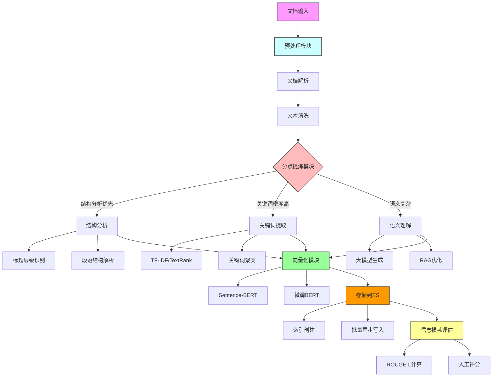
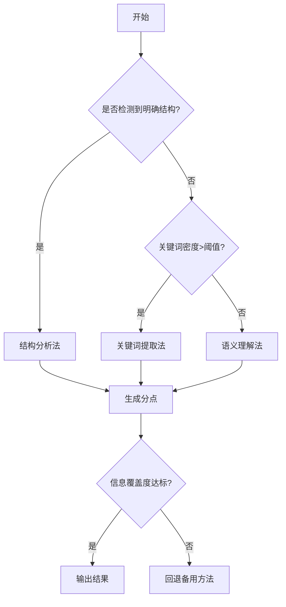
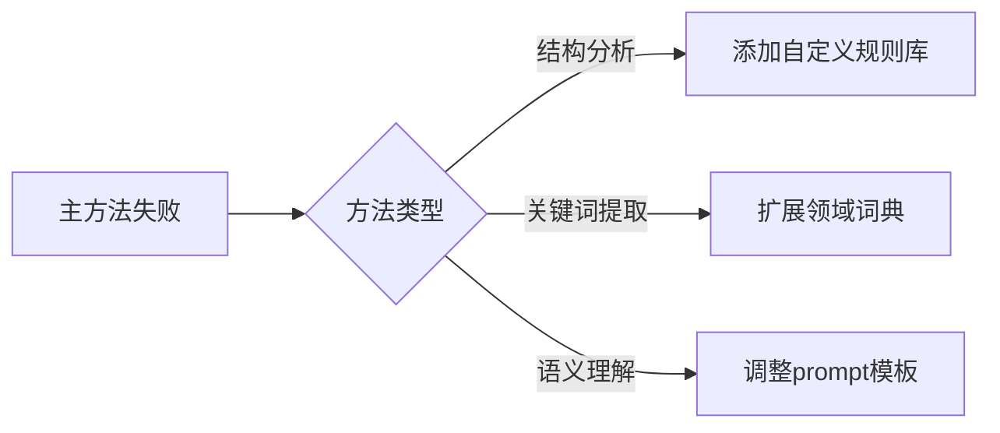

# Q1：基于下面内容给出具体的技术方案

3.2.3 文档分点提炼（算法）
- 需求描述：提供文档分点提炼接口，生成文档分点提炼向量化数据，后端存储到ES库
- 需求定义：
  - 对文档内容进行结构化处理，以分点的形式提炼出关键信息和重要内容
  - 优先对本次「文档分类标签」相关文档进行支持
- 展现形式：
  - 基于文本结构分析：根据文档的标题、段落结构、章节划分等，识别出不同层次的主题和内容模块，将其转化为相应的要点。例如，对于一篇具有明确章节结构的学术论文，可以将每个章节的核心内容提炼为一个要点。
  - 基于关键词提取：先提取文档中的关键词，在围绕这些关键词，结合上下文内容，提炼出与之相关的关键信息，并以分点的形式呈现。比如在一篇新闻报道中，根据 “地震”“救援”“伤亡情况” 等关键词，分别提炼出关于地震发生时间地点、救援进展、伤亡人数等要点。
  - 基于语义理解：利用大模型对文档进行语义分析，理解句子和段落之间的语义关系，识别出重要的陈述和观点，将其归纳为不同的要点。
- 支持模型：待定
- 信息损耗：待评估提炼信息后的内容信息损耗

---

### 技术方案设计：文档分点提炼与向量化存储

---

#### **一、整体架构**
1. **流程概览**  
   ```
   文档输入 → 预处理 → 分点提炼 → 向量化 → 存储至ES
   ```
2. **模块划分**  
   - 预处理模块：文档解析、文本清洗  
   - 分点提炼模块：结构分析、关键词提取、语义理解  
   - 向量化模块：嵌入模型生成向量  
   - 存储模块：Elasticsearch 数据持久化  

---

#### **二、关键技术实现**

##### **1. 预处理模块**
- **输入支持**  
  - 格式：PDF、Word、Markdown、TXT  
  - 解析工具：Apache Tika（通用解析）、PyMuPDF（PDF深度解析）  
- **文本清洗**  
  - 去除冗余符号、分段分句、保留标题/段落层级标记  

##### **2. 分点提炼模块**（核心）
采用 **三级分层提炼策略**，优先结构分析，动态结合关键词与语义方法：

| 方法                | 技术实现                                                                 | 适用场景                     |
|---------------------|--------------------------------------------------------------------------|------------------------------|
| **结构分析**        | - 基于正则匹配标题层级（如 `## 2.1`）<br>- SpaCy 依存分析识别段落逻辑结构 | 学术论文、技术文档等结构化文档 |
| **关键词提取**       | - TF-IDF + TextRank 提取关键词<br>- 基于关键词聚类生成分点（K-means）    | 新闻、短文本等非结构化内容    |
| **语义理解**         | - 大模型分点生成（如GPT-4/Claude生成JSON）<br>- 基于RAG优化提示词        | 复杂语义、跨段落推理场景       |

**优先级策略**：  
- 若检测到明确标题结构（如 `章节>段落>列表`），优先结构分析  
- 若关键词密度高且分布集中，触发关键词提炼  
- 若文本语义复杂度高（通过困惑度评估），调用大模型  

##### **3. 向量化模块**
- **模型选择**  
  - 通用场景：Sentence-BERT（`all-mpnet-base-v2`）  
  - 领域适配：微调BERT模型（需标注数据）  
- **输出格式**  
  ```json
  {
    "points": ["要点1", "要点2"], 
    "vectors": [[0.23, ...], [-0.45, ...]]
  }
  ```

##### **4. 存储模块（Elasticsearch）**
- **索引设计**  
  ```json
  {
    "mappings": {
      "properties": {
        "doc_id": {"type": "keyword"},
        "points": {"type": "text", "analyzer": "ik_max_word"},
        "vector": {"type": "dense_vector", "dims": 768},
        "tags": {"type": "keyword"}  // 文档分类标签
      }
    }
  }
  ```
- **写入优化**  
  - 批量异步写入（Bulk API）  
  - 向量字段启用`index: true`支持相似度检索  

---

#### **三、模型选型建议**
| 任务                | 候选方案                          | 优势                          |
|---------------------|-----------------------------------|-------------------------------|
| 结构分析            | SpaCy + 自定义规则引擎            | 高精度、低延迟                |
| 关键词提取          | TextRank + 领域词典增强           | 无需训练、可解释性强          |
| 语义理解            | DeepSeek-Ranker（中文优化）       | 支持长文本、多轮迭代生成      |
| 向量化              | BAAI/bge-large-zh-v1.5           | 中文语义表征SOTA              |

---

#### **四、信息损耗评估方案**
1. **量化指标**  
   - **ROUGE-L**：提炼内容与原文摘要的召回率  
   - **人工评分**：关键信息覆盖率（0-5分制）  
2. **评估流程**  
   ```python
   def evaluate_loss(original, points):
       # 自动评估
       rouge = Rouge().get_scores(points, original_summary)
       # 人工评估
       human_score = submit_to_labeling_platform(original, points)
       return {"rouge": rouge, "human_score": human_score}
   ```

---

#### **五、扩展性设计**
1. **插件化处理链**  
   - 通过配置开关启用/禁用特定提炼方法  
2. **分类标签路由**  
   - 基于文档分类标签选择处理策略（如 `技术文档→结构分析`，`新闻→关键词提取`）  
3. **模型热更新**  
   - 使用Model Zoo管理多版本嵌入模型  

---

#### **六、交付物清单**
1. RESTful API 接口：`POST /api/extract_points`  
2. ES索引自动创建脚本  
3. 信息损耗评估报告模板  
4. 预置规则库（标题正则、领域关键词词典）  

---

该方案通过分层提炼策略平衡精度与性能，结合规则与AI模型实现可解释的结构化输出，适合逐步迭代优化。

以下是基于技术方案的Mermaid流程图：



**流程说明**：
1. **预处理模块**：完成文档解析和文本清洗
2. **分点提炼模块**：
   - 通过菱形决策节点自动路由到最优方法
   - 三种方法并行存在但根据策略优先级触发
3. **向量化模块**：支持多模型选择
4. **ES存储**：包含索引管理和写入优化
5. **评估环节**：闭环验证信息完整性

**图形特征**：
- 不同模块使用不同色块区分
- 核心提炼模块采用红色强调
- 决策节点隐含业务路由逻辑
- 评估环节使用浅黄色标注后续验证过程

如果需要更详细的子流程（如结构分析具体步骤），可以展开对应模块的二级流程图。


# Q2：分点提炼模块的【展现形式】有三种，那我怎么判断用哪个？

以下是判断文档分点提炼方法的 **决策逻辑与实施指南**，通过规则引擎与机器学习结合实现动态路由：

---

### **一、决策流程图（规则优先级）**


---

### **二、具体判断逻辑**

#### **1. 结构分析法触发条件**
```python
def has_structured_layout(text):
    # 规则1：标题层级检测（正则匹配）
    heading_level = re.findall(r'#{1,5}\s.+', text)  # 匹配Markdown标题
    # 规则2：段落逻辑结构检测（SpaCy依存分析）
    doc = nlp(text)
    section_breaks = [sent for sent in doc.sents if "首先" in sent.text or "综上所述" in sent.text]
    # 判定标准：存在至少两级标题且段落逻辑词>2个
    return len(heading_level)>=2 and len(section_breaks)>=2
```

#### **2. 关键词提取法触发条件**
```python
def need_keyword_extraction(text):
    # 步骤1：提取关键词
    keywords = jieba.analyse.textrank(text, topK=20)
    # 步骤2：计算密度指标
    total_words = len(text.split())
    keyword_density = sum([text.count(kw) for kw in keywords]) / total_words
    # 判定标准：密度>0.15且关键词集中度>60%
    return keyword_density > 0.15 and len(keywords[:5])/len(keywords) > 0.6
```

#### **3. 语义理解法触发条件**
```python
def require_semantic_analysis(text):
    # 指标1：句子平均长度>25字
    avg_len = sum(len(sent) for sent in text.split('。')) / len(text.split('。'))
    # 指标2：专业术语占比（需预置术语库）
    term_count = count_technical_terms(text)
    # 判定标准：长文本且专业性强
    return avg_len >25 and term_count >10
```

---

### **三、动态路由策略**

#### **1. 基于分类标签的预判（优先执行）**
```markdown
| 文档分类标签       | 强制使用方法      | 示例场景              |
|--------------------|-------------------|-----------------------|
| 技术文档/论文      | 结构分析          | API手册、学术论文     |
| 新闻/社交媒体      | 关键词提取        | 突发事件报道、微博长文|
| 法律/合同          | 语义理解          | 保密协议、判决书      |
```

#### **2. 混合模式（高精度场景）**
```python
# 组合三种方法的结果，通过投票机制选择最优分点
ensemble_points = []
if confidence(structured_points) > 0.7:
    ensemble_points.extend(structured_points)
if confidence(keyword_points) > 0.6: 
    ensemble_points.extend(keyword_points)
# 最终用大模型去重合并
final_points = llm_merge(ensemble_points)
```

---

### **四、实施建议**

1. **冷启动阶段**  
   - 对历史文档人工标注 **结构类型标记**（如`[标题层级]`、`[松散文本]`）  
   - 构建 **分类标签-方法映射表**（如 `tag:技术文档 → method:结构分析`）

2. **效果监控指标**  
   ```python
   monitoring_metrics = {
       '结构分析成功率': 'heading_hit_rate',
       '关键词召回率': 'keyword_recall@10',
       '语义理解耗时': 'llm_latency_p95'
   }
   ```

3. **异常处理机制**  
   - 当结构分析提取点数<3时自动触发语义理解补全  
   - 关键词提取结果重复率>40%时切换方法

---

### **五、示例判断场景**

#### **案例1：技术白皮书**
```text
检测结果：
- 存在三级标题（## 1.1、### 1.1.1）
- 段落包含"首先、其次、最后"逻辑词
- 分类标签为"技术文档"
决策路径：结构分析法（命中规则优先级）
```

#### **案例2：财经新闻**
```text
检测结果：
- 无标题结构
- 关键词密度0.18（"美联储"、"加息"、"通胀"高频出现）
- 分类标签为"金融新闻"
决策路径：关键词提取法
```

#### **案例3：医疗研究报告**
```text
检测结果：
- 存在二级标题但段落含复杂数据推论
- 平均句子长度32字，专业术语占比15%
决策路径：语义理解法（即使有结构也需深度解析）
```

---

通过这种分层决策机制，可以在保证处理效率的同时，针对不同文档特征选择最优提炼方式。建议初期以规则为主，逐步引入机器学习模型预测最佳方法。

# Q3：【回退备用方法】怎么做？

以下是关于 **回退备用方法** 的详细设计与实现方案：

---

### **一、回退触发条件**
```python
# 信息覆盖度判定（主方法失败时触发回退）
def check_coverage(points, original_text):
    # 指标1：关键实体召回率（如人名、地点、数据）
    entity_recall = len(entity_intersection(points, original_text)) / total_entities
    # 指标2：ROUGE-L > 0.65
    rouge_score = calculate_rouge(points, original_text)  
    return entity_recall < 0.5 or rouge_score < 0.65
```

---

### **二、回退层级策略**
采用 **三级递进式回退机制**，优先切换方法，最后启用人工审核：

#### **1. 第一级回退：同类方法增强**


**示例**：  
- 结构分析失败 → 加载预定义的《技术文档标题规则库》重新解析  
- 关键词提取召回低 → 注入领域专有名词（如金融术语表）

#### **2. 第二级回退：跨方法降级**
```python
# 优先级顺序：结构分析 → 关键词 → 语义理解 → 混合模式
fallback_chain = [
    "structured_analysis_v2",  # 增强版结构解析
    "keyword_extract_with_llm", # 大模型辅助关键词
    "semantic_analysis",        # 原始语义方法
    "ensemble_method"          # 混合所有结果
]
```

**实现逻辑**：  
```python
current_method = "structured_analysis"
while not coverage_ok:
    result = try_method(current_method)
    if check_coverage(result):
        break
    current_method = get_next_fallback(fallback_chain)
```

#### **3. 第三级回退：人工干预**
```markdown
1. 自动生成报警消息（飞书/钉钉机器人通知）
2. 将低质量结果存入待审核队列（MySQL `pending_review`表）
3. 人工标注后回写系统，同时用于模型训练
```

---

### **三、关键技术实现**

#### **1. 方法增强实现（第一级回退）**
**案例：结构分析增强**
```python
def enhanced_structured_analysis(text):
    # 步骤1：注入常见标题变体正则
    custom_patterns = load_rules("tech_doc_titles.yaml") 
    # 步骤2：用大模型修复残缺结构
    repaired_text = llm_fix_structure(text, prompt="补全缺失的章节标题")  
    # 步骤3：二次解析
    return default_structured_analysis(repaired_text)
```

#### **2. 跨方法降级实现（第二级回退）**
**案例：结构分析 → 关键词提取降级**
```python
def hybrid_fallback(text):
    # 先用结构分析提取大纲
    outline = structured_analysis(text)  
    # 对未覆盖段落用关键词补充
    uncovered_paragraphs = detect_uncovered(text, outline)
    for para in uncovered_paragraphs:
        outline.extend(keyword_extract(para)) 
    return outline
```

#### **3. 结果融合策略**
```python
def merge_results(main_result, fallback_result):
    # 基于语义相似度去重
    unique_points = []
    for point in main_result + fallback_result:
        if all(similarity(point, exist) < 0.7 for exist in unique_points):
            unique_points.append(point)
    return unique_points[:10]  # 控制最大点数
```

---

### **四、回退路径示例**

#### **场景：技术文档结构解析失败**
```text
原始流程：
结构分析 → 检测到2级标题但覆盖度不足（ROUGE-L=0.58）

回退过程：
1. 第一级回退：加载《API文档专用规则库》重试 → 覆盖度提升至0.63
2. 第二级回退：对未覆盖段落启动关键词提取 → 合并后ROUGE-L=0.71（达标）
```

#### **场景：新闻关键词提取失效**
```text
原始流程：
关键词提取 → 密度达标但关键事件遗漏

回退过程：
1. 第一级回退：加入媒体事件词库（地震等级、伤亡表述）→ 仍缺失时间地点
2. 第二级回退：启动语义理解 → 补全"时间:2023-08-05 地点:山东平原"
```

---

### **五、监控与治理**

#### **1. 回退看板指标**
| 指标名称               | 报警阈值       | 监控方法               |
|------------------------|----------------|------------------------|
| 一级回退触发率         | >20%           | 滑动窗口统计（1小时）  |
| 人工干预占比           | >5%            | 每日定时任务扫描       |
| 平均回退深度           | >2             | 请求日志标记分析       |

#### **2. 自动优化机制**
```python
# 当某类文档回退率持续偏高时：
if fallback_rate("法律文档") > 30%:
    # 自动生成增强规则需求
    create_jira_task("更新法律文档结构规则库")
    # 触发专项模型微调
    retrain_model(category="legal")
```

---

### **六、设计原则**
1. **最小降级原则**：优先在同类方法中增强，避免跨方法带来的性能损耗  
2. **结果可追溯**：记录完整回退路径（如 `method_chain: [结构化→关键词→语义]`）  
3. **自动进化**：将回退案例自动转化为训练数据，持续优化主方法

通过这种分层回退机制，系统可在保证服务可用性的同时，为后续优化提供明确方向。