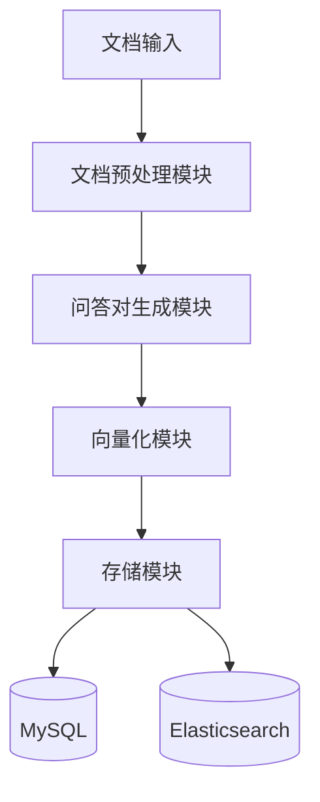
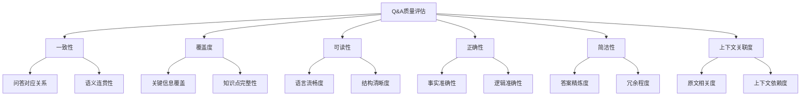
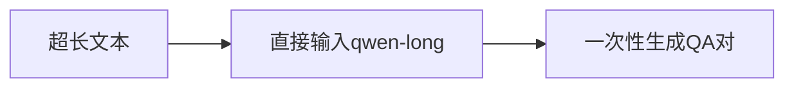
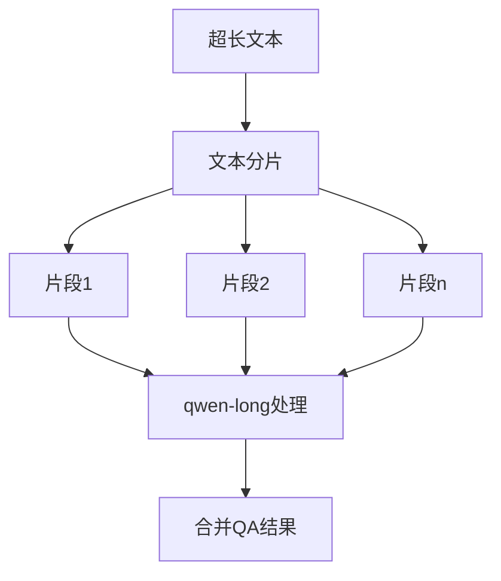
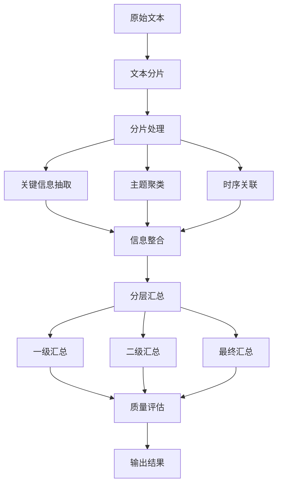

# Q1：
基于下面内容给出具体的技术方案

3.2.4 文档问答对生成（算法+后端）
- 需求描述：
  - 问答对生成（算法）：提供文档问题与答案对生成接口，后端存入数据库
  - 问题向量化（后端）：把从文档问题进行向量化，后端存储到ES库
- 支持模型：qwen2.5_72B_128k（暂定）
- 需求定义：
  - 文档问题：基于内容要点、核心内容提问，确保问题围绕原文内容
  - 文档答案：确保答案在原文中有依据，从总结内容里提取信息进行回答

  我来为您提供一个详细的技术方案建议：

### 1. 系统架构设计



### 2. 具体实现方案

#### 2.1 文档预处理模块
```python
class DocumentPreprocessor:
    def __init__(self):
        self.nlp = spacy.load("zh_core_web_sm")
    
    def process(self, document: str) -> List[str]:
        # 文档分段
        segments = self._split_document(document)
        # 关键信息提取
        key_points = self._extract_key_points(segments)
        return key_points
```

#### 2.2 问答对生成模块
```python
class QAPairGenerator:
    def __init__(self):
        self.model = AutoModelForCausalLM.from_pretrained("Qwen/Qwen2.5-72B-128K")
        
    def generate_qa_pairs(self, content: str) -> List[Dict]:
        prompt = self._construct_prompt(content)
        # 使用模型生成问答对
        qa_pairs = self._generate_with_model(prompt)
        return qa_pairs
```

#### 2.3 向量化模块
```python
class VectorEncoder:
    def __init__(self):
        self.encoder = SentenceTransformer('paraphrase-multilingual-mpnet-base-v2')
        
    def encode(self, question: str) -> np.ndarray:
        return self.encoder.encode(question)
```

#### 2.4 数据存储模块
```python
class StorageManager:
    def __init__(self):
        self.mysql_client = MySQLClient()
        self.es_client = ElasticsearchClient()
        
    def store_qa_pair(self, qa_pair: Dict):
        # 存储问答对到MySQL
        qa_id = self.mysql_client.insert_qa_pair(qa_pair)
        
        # 存储问题向量到ES
        vector = self.vector_encoder.encode(qa_pair['question'])
        self.es_client.index_question_vector(qa_id, vector)
```

### 3. API接口设计

```python
@app.post("/api/v1/qa-generation")
async def generate_qa_pairs(document: Document):
    # 1. 预处理文档
    processed_content = doc_processor.process(document.content)
    
    # 2. 生成问答对
    qa_pairs = qa_generator.generate_qa_pairs(processed_content)
    
    # 3. 向量化并存储
    for qa_pair in qa_pairs:
        storage_manager.store_qa_pair(qa_pair)
    
    return {"status": "success", "qa_pairs": qa_pairs}
```

### 4. 数据库设计

#### 4.1 MySQL表结构
```sql
CREATE TABLE qa_pairs (
    id BIGINT PRIMARY KEY AUTO_INCREMENT,
    question TEXT NOT NULL,
    answer TEXT NOT NULL,
    document_id BIGINT NOT NULL,
    created_at TIMESTAMP DEFAULT CURRENT_TIMESTAMP,
    FOREIGN KEY (document_id) REFERENCES documents(id)
);
```

#### 4.2 Elasticsearch索引设计
```json
{
  "mappings": {
    "properties": {
      "question_id": { "type": "keyword" },
      "question_vector": { 
        "type": "dense_vector",
        "dims": 768
      }
    }
  }
}
```

### 5. 关键技术要点

1. **问答对生成策略**：
   - 使用提示工程优化问答质量
   - 设置合理的温度参数控制生成的多样性
   - 实现答案验证机制确保答案准确性

2. **向量化优化**：
   - 使用批处理提高向量化效率
   - 实现向量缓存机制
   - 定期更新向量模型

3. **存储优化**：
   - 实现异步存储机制
   - 建立合适的索引提高查询效率
   - 实现数据定期清理机制

### 6. 性能优化建议

1. 使用异步处理提高并发性能
2. 实现问答对生成的批处理机制
3. 使用缓存减少重复计算
4. 实现定时任务处理大规模文档
5. 采用分布式架构提高系统扩展性

这个方案考虑了系统的可扩展性和性能优化，同时确保了问答对的质量和准确性。您觉得这个方案怎么样？如果有任何需要调整或补充的地方，我很乐意继续讨论。

# Q2：请参考：
@https://www.53ai.com/news/RAG/2024072010574.html 
@https://zhuanlan.zhihu.com/p/373244147 
@https://hub.baai.ac.cn/view/33390 

主要是要针对短文本和长文本情况下，设置路由控制策略，给出落地生产的技术方案和关键流程设计（mermaid绘制）

以下方案，基于参考文献 [53AI 开箱即用大模型应用平台](https://www.53ai.com/news/RAG/2024072010574.html)、[知乎专栏](https://zhuanlan.zhihu.com/p/373244147) 以及 [BAAI 社区文章](https://hub.baai.ac.cn/view/33390) 的内容，重点介绍在短文本与长文本处理场景下的路由控制策略与落地生产的关键技术流程。

---

## 一、整体思路

1. 当文档较短时（如 FAQ、简要说明等）：  
   • 可通过关键词提取与基础信息抽取，快速生成候选问题；  
   • 使用轻量级大模型（或经 Fine-Tuning 后的模型）直接完成问答对生成；  
   • 由于文本较短，解析和存储的效率较高，适合快速上线。  

2. 当文档较长时（如企业报告、技术白皮书等）：  
   • 首先对文档进行切分、摘要或分段索引（可使用 RAG 思路）；  
   • 建立上下文检索机制（向量索引、段落映射表等），辅助大模型进行问答；  
   • 根据不同的场景与文本复杂度，再采用知识图谱、关键词路由等多策略，实现针对性问答。  

3. 路由控制策略：  
   • 当检测到文本字数、小标题占比、段落数等指标满足“短文本”阈值时，走“短文本”问答生成流程；  
   • 当超出阈值时，自动路由至“长文本”流程，先进行切分或检索，再构建问答；  
   • 此过程可在事务层面、API 层面或中间件层面完成，确保系统可灵活集成并对外提供统一服务。  

---

## 二、核心流程设计

```mermaid
flowchart TD
    A[文档上传] --> B[文档属性检测] --> C{短文本\n还是\n长文本?}
    C -- 短文本 --> D[短文本问答生成\n(直接生成)]
    D --> E[问答对存储]
    C -- 长文本 --> G[文本切分\n向量化]
    G --> H[上下文检索\n多轮生成]
    H --> E[问答对存储]
    E --> I[路由结果反馈\n& API返回]
```

1. 文档上传（A）  
   • 接收用户上传或系统自动抓取的文档，此时会记录文档元信息（文件名、字数、段落结构、时间戳等）。  

2. 文档属性检测（B）  
   • 统计字数、段落数、提取目录信息等；  
   • 若识别到非常复杂的表格或图信息，可后续进一步做图文 OCR 解析。  

3. 路由判断（C）  
   • 判断是否为短文本（阈值可设置为适合业务场景，如字数<1000、或段落<5、或标题稀少等条件）；  
   • 若是短文本，通常可直接输入大模型生成问答对；  
   • 若是长文本，进入文本切分与检索流程；  

4. 短文本问答生成（D）  
   • 调用轻量模型直接生成问答对；  
   • 对于 FAQ 类的文本，可采用基于模板或关键句抽取的方式先行生成问题，再调用大模型补充；  
   • 典型示例：FAQ 场景、客户咨询小贴士等。  

5. 文档切分与向量化（G）  
   • 当文档较长，先进行一定的分段切分；  
   • 使用词向量模型或 SentenceTransformer 对每段文本向量化；  
   • 可参考 [知乎专栏的RAG流程](https://zhuanlan.zhihu.com/p/373244147) 或 [BAAI文中提及的多文档图构思路](https://hub.baai.ac.cn/view/33390) 建立上下文抽取流程。  

6. 上下文检索与多轮生成（H）  
   • 将问题与长文档对应的段落进行相似度匹配，检索最相关的段落；  
   • 与大模型多轮交互，确保基于上下文的问答生成。  
   • 可在这里加入知识图谱或 MDR（Multi-hop Document Retrieval）策略提升准确性。  

7. 问答对存储（E）  
   • 将生成好的问答对存入数据库（MySQL/PG 等），存储结构包括：  
     - 文档ID  
     - 问题、答案  
     - 原始上下文/切分片段信息  
     - 创建时间、作者等元信息  
   • 问题向量存入 Elasticsearch（或向量数据库）辅助后续检索。  

8. 路由结果与 API 返回（I）  
   • 将生成后的问答信息统一以接口形式返回；  
   • 同时可将路由过程、耗时等统计信息存入日志，用于后续分析与性能调优。  

---

## 三、关键技术模块

1. 文档预处理与路由模块  
   ```python:path/to/file
   class DocumentRouter:
       def __init__(self, threshold=1000):
           self.threshold = threshold

       def route_text(self, doc_text: str) -> str:
           # 根据字数、段落数等判断路由
           if len(doc_text) <= self.threshold:
               return "short"
           else:
               return "long"
   ```
   - 可结合段落数量、标题信息进行综合判断，而不仅限于字数；  
   - 若需考虑 PDF、表格等结构化内容可在此处增加解析逻辑。  

2. 短文本快速问答生成功能  
   ```python:path/to/file
   def generate_short_qa_pairs(doc_text: str, model) -> list:
       """
       使用轻量级模型直接生成问答对
       """
       # 简易示例：先抽取关键句，再通过模型补全问题+答案
       prompt = f"基于以下内容生成简短的问答对:\n{doc_text}\n"
       qa_result = model.generate(prompt)
       return qa_result
   ```

3. 长文本检索与多轮生成功能  
   ```python:path/to/file
   def generate_long_qa_pairs(doc_segments: list, question: str, llm_model, vector_store) -> str:
       """
       先检索，再多轮生成。此处只演示核心思路。
       """
       # 1. 对 question 做向量化
       q_vector = vector_store.encode(question)
       # 2. 检索最相关的段落
       relevant_segments = vector_store.search(q_vector, top_k=3)
       # 3. 组织上下文与 LLM 进行多轮交互
       context = "\n".join(relevant_segments)
       final_prompt = f"问题：{question}\n参考上下文：{context}\n请给出答案："
       answer = llm_model.generate(final_prompt)
       return answer
   ```

4. 问答对落库（后端存储）与向量化索引  
   ```python:path/to/file
   class QAStorage:
       def __init__(self, db_client, es_client):
           self.db_client = db_client
           self.es_client = es_client

       def save_qa_pair(self, question: str, answer: str, doc_id: int, context: str):
           # 1. 存入数据库
           qa_id = self.db_client.insert_qa(question, answer, doc_id, context)
           # 2. 做向量化后存入ES
           vector = self.es_client.encode(question)
           self.es_client.index_document(qa_id, question, vector)
           return qa_id
   ```

---

## 四、生产落地关键注意事项

1. 路由阈值调优  
   • 根据业务实际情况和模型性能进行门槛微调，避免过于频繁地误判文档类型；  
   • 同时支持手动覆盖机制，针对某些特殊文档类型进行人工判定。  

2. 大规模并发与性能  
   • 对于高并发环境，需要加入异步处理或消息队列；  
   • 大容量存储下，需优化检索索引的刷新策略，并可通过分片 or 分库提升查询效率。  

3. 多语言与多模态扩展  
   • 若需要支持多语言（中英文混合文档），在路由阶段亦可增加语言分类；  
   • 对于含图片、表格的PDF，可在长文本处理时加入OCR或图文结合解析的子流程。  

4. 容错与安全策略  
   • 过滤文档中的敏感词汇或敏感信息，满足监管合规要求；  
   • 生成问答对后进行自动化审校或人工抽样复核，防止内容扩散风险。  

---

## 五、总结

通过对短文本与长文本进行路由分流，可以显著提升问答生成效率与准确性。在短文本场景下，直连大模型即可快速产出结果；而在长文本场景下，则结合向量化检索、多轮生成或知识图谱方案进一步保障问答质量。在具体生产落地过程中，需要结合业务需求对路由策略进行灵活掌控，并在存储与检索层面做好扩展性设计，以满足后续不断增长的数据规模与查询请求。

---

### 参考文献

- [53AI：开箱即用的企业大模型应用平台](https://www.53ai.com/news/RAG/2024072010574.html)  
- [如何使用QA抽取在RAG场景中构建企业级文档问答](https://zhuanlan.zhihu.com/p/373244147)  
- [BAAI社区：再看知识图谱融合大模型RAG问答](https://hub.baai.ac.cn/view/33390)  

以上方案在此基础上可进行更多个性化扩展，如与内部知识库对接、多模态增强、上下文对齐等，最终落地至生产环境时，也可分阶段逐步实现。希望能对您在构建多场景文档问答系统时有所帮助。

# Q3：帮我看看如何细化下面<描述>，我希望你能针对落地生产的角度，如何设置逻辑控制流程来确保功能的完整、高效和灵活！

<描述>
本文所介绍的方法，会使用千问官方的qwen-long模型，对《2024全球经济金融展望报告》这个文档抽取QA，这个模型足够便宜，抽取的结果质量也还不错。QA抽取包含如下3个步骤：

短文档片段QA抽取：这部分模拟日常情况下，经常会询问细节性问题的使用场景

长文档片段QA抽取：这部分模拟需要综合较多上下文才能回答的使用场景

QA质量打分：使用LLM再次对抽取的QA进行质量评估，这一步算是借鉴了微软phi-1.5模型Textbooks Are All You Need论文中的方法，就是借助模型对数据质量进行评估
</描述>

以下是针对 <描述> 的进一步细化方案，重点阐述如何在落地生产环境中，设置逻辑控制流程来确保功能的完整、高效和灵活。

---

## 一、整体流程控制

在生产环境中，为了确保短文档片段和长文档片段的 QA 抽取流程有条不紊，可以按照以下步骤进行整体设计：

```mermaid
flowchart TD
    A[文档上传/识别] --> B[文档切分 & 检测<br>判断短片段/长片段]
    B -- 短片段 --> C[短片段QA抽取<br>使用qwen-long模型]
    B -- 长片段 --> D[长片段QA抽取<br>使用qwen-long模型]
    C --> E[QA质量打分<br>评估短片段QA]
    D --> F[QA质量打分<br>评估长片段QA]
    E --> G[QA结果入库<br>(Q&A + 质量分)]
    F --> G[QA结果入库<br>(Q&A + 质量分)]
    G --> H[对外服务/API]
```

1. 文档上传/识别（A）  
   • 从文件系统、爬虫、或用户上传获取文档，例如《2024全球经济金融展望报告》；  
   • 记录文档元信息（如标题、时间、文件类型等）。

2. 文档切分 & 检测（B）  
   • 将文档切分成多个段落；可结合自然段、主题段落、语义段落等多种策略；  
   • 根据切分后片段的长度（比如字数阈值、段落数量）判断是否属于短片段或长片段；  
   • 可在此处加入“路由控制策略”的拓展逻辑，比如基于标题数量、关键字出现频次等，为后续抽取做准备。

3. 短片段 QA 抽取（C）  
   • 对于短片段，通常可以直接将段落文本喂给 qwen-long 模型，让其生成或抽取 Q&A；  
   • 这里可考虑增加多个提示模板（Prompt Template），以适配不同类型的小段落。

4. 长片段 QA 抽取（D）  
   • 对于长片段，可能需要分多次推理，或者先做摘要/向量检索，引入 RAG（Retrieval-Augmentation Generation）策略；  
   • 若部分段落长度依旧超出模型输入限制，可再次切分；  
   • 结合查找全局信息再回答问题，模拟需要综合多个上下文才能回答的场景。

5. QA 质量打分（E / F）  
   • 使用 qwen-long (或者其他 LLM) 对前一步得到的 Q&A 进行质量评估；  
   • 参考微软 phi-1.5 模型中的思路，通过对 Q&A 的一致性、覆盖度和可读性进行打分；  
   • 可考虑生成多维度评分（如正确性、简洁性、上下文关联度等），并可设置阈值过滤低质量结果。

6. QA 结果入库（G）  
   • 最终将 Q&A 以及质量评分一并存储至数据库或搜索引擎（MySQL、Elasticsearch 等），也可在此保存与原文片段的映射关系，方便后续追溯或二次检索；  
   • 若评分过低的结果，可以选用人工审校或自动丢弃，以保证数据整体质量。

7. 对外服务/API（H）  
   • 对外提供统一的接口，便于其他系统如 Chatbot、企业知识库前端等快速集成；  
   • 返回格式可包含 Q&A、评分、原文链接/段落 ID 等元信息，提升可追溯性与可解释性。

---

## 二、逻辑控制设计思路

1. 路由控制  
   • 在生产上线时，建议封装“判断短片段/长片段”的逻辑，允许动态调整阈值（如最大字数、段落数）  
   • 提供可配置化的管理后台或配置文件，灵活应对文档规模的变化（如以后可能出现更大、更复杂的文档类型）。

2. 模型调用策略  
   • 对于短片段：  
     - 一次性调用 qwen-long 模型；  
     - 使用 Prompt Template 摆明需求：根据该段落生成尽可能多的“简短问题”和“答案”，可限定问题数量或主题范围（如：与经济数据相关，或与预测相关）。  
   • 对于长片段：  
     - 拆分为多个子段落；  
     - 考虑先进行向量化检索，以及多轮对话引导大模型产出更准确的答案；  
     - 如果段落过长，可以基于摘要结果或关键点提取后再次调用 LLM，减少无关信息干扰。

3. QA 质量评估  
   • 可以维护一个“质量AI”作评测，采用类似 Chain-of-Thought 或 self-consistency 提示，让模型充分思考 Q&A 的合理性；  
   • 打分后可定义若干规则，如低于某分阈值就进行人工暂存待审核；  
   • 评估结果同时可以用于持续优化 Prompt Template 或进行 Fine-tuning 提升模型在特定领域的输出质量。

4. 数据管理 & 监控  
   • 设计一个表结构/索引结构，将 Q&A 及其评分与原文进行映射，如 “report_id”、“paragraph_id”等；  
   • 若出现数据激增，可在数据库层面或向量数据库层面做分片、做集群部署；  
   • 提供监控和报警机制，如 Q&A 成功率、平均响应时间、质量分布情况等实时监控，以便及时发现异常并反馈处理。

---

## 三、落地生产关键点与建议

1. 多线程/异步处理  
   • 对于长文档的循环切分与多次调用大模型，应考虑使用协程或多线程池提高并发度，减少单点阻塞。  
   • 在高并发场景下可引入消息队列（如 RabbitMQ、Kafka）实现异步处理，把长耗时任务拆分到后台执行。

2. 灵活的阈值调整  
   • 可以配置多个维度的阈值，而不仅仅是字数，如段落数、标题结构、表格数量等；  
   • 可以动态调配模型资源（如 GPU/CPU），在高峰期对低价值文档先行排队，保证核心文档先抽取。

3. 多层缓存与检索  
   • 采用 Redis 或本地缓存，将常见问答对、常用摘要先行缓存；  
   • 可以做向量数据库（如 Milvus、Faiss）加速长文本的检索过程，从而减少大模型不必要的重复推理次数。

4. 权限控制与数据安全  
   • 如果文档需要保密，须在数据库阶段或检索阶段实现加密或权限隔离；  
   • 访问 Q&A 接口时，需鉴权并控制用户可查看的内容范围。

5. 迭代演进  
   • 建议先上线 MVP（最小可行产品），跑通基础流程，根据 QA 质量评估分来 iterative 迭代；  
   • 收集用户的搜索日志、交互反馈，分析错答或低质量回答的原因，进一步打磨数据处理、Prompt Template 或做贴近场景的 Fine-tuning。

---

## 四、示例：核心伪代码

以下仅作为示例，展示如何在生产中组织逻辑控制。

```python:path/to/workflow/document_qa.py
class DocumentQAWorkflow:
    def __init__(self, max_short_length=1000, llm_short, llm_long, llm_eval):
        self.max_short_length = max_short_length
        self.llm_short = llm_short
        self.llm_long = llm_long
        self.llm_eval = llm_eval

    def process_document(self, document_text: str, document_id: int):
        """
        主流程，涵盖短/长片段抽取和质量评估
        """
        # 1. 分段
        segments = self.split_into_segments(document_text)

        # 2. 路由
        qa_results = []
        for seg in segments:
            if len(seg) <= self.max_short_length:
                # 短片段
                qa_list = self.generate_short_qa(seg)
            else:
                # 长片段
                qa_list = self.generate_long_qa(seg)

            # 3. 对抽取结果进行质量评估
            evaluated_qa_list = []
            for qa in qa_list:
                score = self.evaluate_qa(qa['question'], qa['answer'], seg)
                qa['score'] = score
                evaluated_qa_list.append(qa)

            qa_results.extend(evaluated_qa_list)

        # 4. 入库
        self.store_qa_results(qa_results, document_id)

        return qa_results

    def split_into_segments(self, text: str) -> list:
        # 示例：可按照段落或自定义分段
        return text.split("\n\n")

    def generate_short_qa(self, segment: str) -> list:
        # 用 llm_short 模型生成QA
        # ...
        return [{"question": "示例问题", "answer": "示例答案"}]

    def generate_long_qa(self, segment: str) -> list:
        # 借助向量检索、RAG 等进行多轮QA
        # 用 llm_long 模型处理
        # ...
        return [{"question": "示例综合问题", "answer": "示例综合答案"}]

    def evaluate_qa(self, question: str, answer: str, context: str) -> float:
        # 用 llm_eval 或其他方法对QA做评估打分
        # ...
        return 0.95

    def store_qa_results(self, qa_list: list, doc_id: int):
        # 入库操作
        # ...
        pass
```

在实际场景中，需要将不同模型的加载、向量数据库的检索实现等部分进行更细粒度的封装，并加上异常处理、日志监控等完整生产要素。

---

## 五、总结

通过上面对 <描述> 的细化，可以看到整套流程在生产环境下，最为关键的是做好“短片段 vs 长片段”的灵活路由，配合对 Q&A 质量评估的打分与存储，实现端到端的抽取与验证闭环。为了让系统更加稳定、可维护，还需要做好日志监控、异常处理和性能调优。若能结合具体业务需求（如企业内部报告的结构化目录、关键词索引），可进一步提升抽取效率和答案准确性。

# Q4： 是不是Q&A 的指标包括【一致性、覆盖度、可读性、正确性、简洁性、上下文关联度】？
是的，这些都是评估 Q&A 质量的重要指标。让我详细展开这些指标的具体实现方案：

## Q&A 质量评估指标体系



### 1. 评分实现示例

```python:path/to/qa_evaluator.py
class QAEvaluator:
    def __init__(self, llm_model):
        self.llm = llm_model
        self.weights = {
            'consistency': 0.2,    # 一致性
            'coverage': 0.2,       # 覆盖度
            'readability': 0.15,   # 可读性
            'accuracy': 0.2,       # 正确性
            'conciseness': 0.1,    # 简洁性
            'context_relevance': 0.15  # 上下文关联度
        }
    
    def evaluate(self, question: str, answer: str, context: str) -> dict:
        """评估QA对的质量并返回多维度分数"""
        scores = {}
        
        # 1. 一致性评估
        scores['consistency'] = self._evaluate_consistency(question, answer)
        
        # 2. 覆盖度评估
        scores['coverage'] = self._evaluate_coverage(answer, context)
        
        # 3. 可读性评估
        scores['readability'] = self._evaluate_readability(answer)
        
        # 4. 正确性评估
        scores['accuracy'] = self._evaluate_accuracy(answer, context)
        
        # 5. 简洁性评估
        scores['conciseness'] = self._evaluate_conciseness(answer)
        
        # 6. 上下文关联度评估
        scores['context_relevance'] = self._evaluate_context_relevance(
            question, answer, context)
        
        # 计算加权总分
        total_score = sum(
            scores[k] * self.weights[k] for k in scores.keys()
        )
        
        return {
            'detailed_scores': scores,
            'total_score': total_score
        }

    def _evaluate_consistency(self, question: str, answer: str) -> float:
        """评估问答一致性"""
        prompt = f"""请评估以下问答对的一致性（0-1分）:
        问题：{question}
        答案：{answer}
        
        评分标准：
        1. 答案是否直接回应了问题
        2. 问答之间的逻辑关系是否清晰
        3. 答案是否存在与问题无关的内容
        
        请给出分数和简要理由。
        """
        response = self.llm.generate(prompt)
        # 解析response获取分数
        return self._extract_score(response)

    def _evaluate_coverage(self, answer: str, context: str) -> float:
        """评估答案对原文关键信息的覆盖程度"""
        prompt = f"""请评估答案对原文关键信息的覆盖程度（0-1分）:
        原文：{context}
        答案：{answer}
        
        评分标准：
        1. 是否包含所有必要的关键信息
        2. 是否遗漏重要细节
        3. 信息的完整性如何
        
        请给出分数和简要理由。
        """
        response = self.llm.generate(prompt)
        return self._extract_score(response)

    def _evaluate_readability(self, answer: str) -> float:
        """评估答案的可读性"""
        prompt = f"""请评估以下答案的可读性（0-1分）:
        答案：{answer}
        
        评分标准：
        1. 语言是否流畅自然
        2. 结构是否清晰
        3. 是否易于理解
        
        请给出分数和简要理由。
        """
        response = self.llm.generate(prompt)
        return self._extract_score(response)
```

### 2. 评分标准详细说明

```python:path/to/scoring_criteria.py
SCORING_CRITERIA = {
    "consistency": {
        "description": "问答的一致性评估",
        "aspects": [
            "问题与答案的直接相关性",
            "语义连贯程度",
            "逻辑对应关系"
        ],
        "scoring_rules": {
            "1.0": "完全一致，答案准确对应问题",
            "0.8": "基本一致，有轻微偏离",
            "0.6": "部分一致，存在明显偏离",
            "0.4": "较差一致性，答非所问",
            "0.2": "严重不一致",
            "0.0": "完全不相关"
        }
    },
    "coverage": {
        "description": "答案对原文信息的覆盖程度",
        "aspects": [
            "关键信息完整性",
            "重要细节保留",
            "核心观点覆盖"
        ],
        "scoring_rules": {
            "1.0": "完整覆盖所有关键信息",
            "0.8": "覆盖大部分关键信息",
            "0.6": "覆盖核心信息但有遗漏",
            "0.4": "关键信息覆盖不足",
            "0.2": "严重遗漏关键信息",
            "0.0": "几乎未覆盖关键信息"
        }
    }
    # ... 其他指标的详细规则
}
```

### 3. 实际应用示例

```python:path/to/qa_pipeline.py
class QAPipeline:
    def __init__(self):
        self.evaluator = QAEvaluator(llm_model)
        self.min_acceptable_score = 0.7
        
    def process_qa_pair(self, question: str, answer: str, context: str):
        """处理单个QA对"""
        # 1. 评估QA质量
        evaluation_result = self.evaluator.evaluate(
            question, answer, context
        )
        
        # 2. 判断是否需要优化
        if evaluation_result['total_score'] < self.min_acceptable_score:
            return self._optimize_qa_pair(
                question, answer, context, evaluation_result
            )
        
        return {
            'question': question,
            'answer': answer,
            'evaluation': evaluation_result,
            'status': 'accepted'
        }
    
    def _optimize_qa_pair(self, question, answer, context, evaluation):
        """优化低质量的QA对"""
        weak_aspects = [
            k for k, v in evaluation['detailed_scores'].items() 
            if v < 0.6
        ]
        
        # 根据薄弱方面进行优化
        optimized_answer = self._generate_improved_answer(
            question, answer, context, weak_aspects
        )
        
        # 重新评估
        new_evaluation = self.evaluator.evaluate(
            question, optimized_answer, context
        )
        
        return {
            'question': question,
            'answer': optimized_answer,
            'evaluation': new_evaluation,
            'status': 'optimized'
        }
```

### 4. 监控与分析

```python:path/to/qa_monitor.py
class QAQualityMonitor:
    def __init__(self):
        self.metrics_store = MetricsStorage()
        
    def log_evaluation(self, qa_id: str, evaluation_result: dict):
        """记录评估结果"""
        self.metrics_store.save_metrics(qa_id, {
            'timestamp': datetime.now(),
            'scores': evaluation_result['detailed_scores'],
            'total_score': evaluation_result['total_score']
        })
    
    def analyze_quality_trends(self, time_range: tuple):
        """分析质量趋势"""
        metrics = self.metrics_store.get_metrics_in_range(time_range)
        
        analysis = {
            'average_scores': self._calculate_average_scores(metrics),
            'weak_aspects': self._identify_weak_aspects(metrics),
            'improvement_suggestions': self._generate_suggestions(metrics)
        }
        
        return analysis
```

### 5. 数据库存储结构

```sql
-- QA评估结果表
CREATE TABLE qa_evaluations (
    id BIGINT PRIMARY KEY AUTO_INCREMENT,
    qa_id BIGINT NOT NULL,
    consistency_score DECIMAL(3,2),
    coverage_score DECIMAL(3,2),
    readability_score DECIMAL(3,2),
    accuracy_score DECIMAL(3,2),
    conciseness_score DECIMAL(3,2),
    context_relevance_score DECIMAL(3,2),
    total_score DECIMAL(3,2),
    evaluation_time TIMESTAMP,
    FOREIGN KEY (qa_id) REFERENCES qa_pairs(id)
);

-- 评估详情表
CREATE TABLE evaluation_details (
    id BIGINT PRIMARY KEY AUTO_INCREMENT,
    evaluation_id BIGINT NOT NULL,
    aspect VARCHAR(50),
    score DECIMAL(3,2),
    feedback TEXT,
    FOREIGN KEY (evaluation_id) REFERENCES qa_evaluations(id)
);
```

### 6. 配置管理

```yaml:path/to/config/evaluation_config.yml
evaluation:
  weights:
    consistency: 0.2
    coverage: 0.2
    readability: 0.15
    accuracy: 0.2
    conciseness: 0.1
    context_relevance: 0.15
  
  thresholds:
    min_acceptable_total: 0.7
    min_aspect_score: 0.6
    
  optimization:
    max_attempts: 3
    improvement_threshold: 0.1
```

这套评估体系可以帮助我们：
1. 全面评估QA质量
2. 识别需要优化的方面
3. 持续监控质量趋势
4. 提供改进建议

建议在实际应用中：
1. 根据具体业务场景调整各指标权重
2. 定期分析评估数据，优化评估标准
3. 建立质量反馈循环，持续改进生成策略
4. 考虑引入人工抽检机制，验证评估系统的准确性

# Q5：如果超长文本下，假设没有超过qwen-long的上下文（1500万），但是我直接用了，是不是属于“一站式”使用；如果我考虑了先做分片，是不是属于“考虑成本”的使用？
是的，您说得对。让我详细分析一下这两种使用方式的优劣势：

### 一、"一站式"使用方式



**优势：**
1. 实现简单，无需复杂的分片逻辑
2. 模型可以看到完整上下文，理解更全面
3. 开发成本低，维护简单

**劣势：**
1. Token消耗大，成本高
2. 响应时间可能较长
3. GPU显存压力大
4. 可能出现注意力分散，关注点不够集中

### 二、"考虑成本"使用方式



**优势：**
1. 成本可控，每次只处理必要的文本量
2. 资源利用更高效
3. 可以并行处理多个分片
4. 更容易实现细粒度的质量控制

**劣势：**
1. 需要额外的分片逻辑
2. 可能损失一些跨片段的上下文信息
3. 实现复杂度较高

### 三、建议的生产实践方案

```python
class DocumentProcessor:
    def __init__(self, 
                 cost_sensitive=True,
                 chunk_size=5000,  # 示例分片大小
                 overlap_size=500):  # 重叠区域大小
        self.cost_sensitive = cost_sensitive
        self.chunk_size = chunk_size
        self.overlap_size = overlap_size
        
    def process_document(self, text: str):
        if not self.cost_sensitive:
            # 一站式处理
            return self._process_whole_document(text)
        else:
            # 分片处理
            return self._process_chunked_document(text)
            
    def _process_whole_document(self, text: str):
        """一站式处理完整文档"""
        prompt = f"""
        请基于以下文档生成问答对：
        {text}
        """
        # 直接调用模型
        return self._call_qwen_long(prompt)
        
    def _process_chunked_document(self, text: str):
        """分片处理文档"""
        chunks = self._create_chunks(text)
        qa_pairs = []
        
        for chunk in chunks:
            # 处理每个分片
            chunk_qa = self._process_chunk(chunk)
            qa_pairs.extend(chunk_qa)
            
        # 去重和合并结果
        return self._merge_qa_pairs(qa_pairs)
        
    def _create_chunks(self, text: str):
        """创建带有重叠的文本分片"""
        chunks = []
        start = 0
        
        while start < len(text):
            end = start + self.chunk_size
            
            # 如果不是最后一个分片，则加入重叠区域
            if end < len(text):
                # 找到合适的分割点（如句号或段落结束）
                end = self._find_proper_break(text, end)
                chunk = text[start:end + self.overlap_size]
            else:
                chunk = text[start:]
                
            chunks.append(chunk)
            start = end
            
        return chunks
        
    def _find_proper_break(self, text: str, position: int) -> int:
        """找到合适的分割点"""
        break_chars = ['.', '。', '\n']
        for i in range(position, max(position - 100, 0), -1):
            if text[i] in break_chars:
                return i
        return position
        
    def _process_chunk(self, chunk: str):
        """处理单个分片"""
        prompt = f"""
        请基于以下文本片段生成问答对：
        {chunk}
        """
        return self._call_qwen_long(prompt)
        
    def _merge_qa_pairs(self, qa_pairs: list):
        """合并和去重QA对"""
        # 使用问题的相似度来去重
        unique_pairs = []
        seen_questions = set()
        
        for qa in qa_pairs:
            question_hash = self._get_question_hash(qa['question'])
            if question_hash not in seen_questions:
                seen_questions.add(question_hash)
                unique_pairs.append(qa)
                
        return unique_pairs
```

### 四、动态决策策略

可以设计一个动态决策系统，根据不同因素来选择使用哪种方式：

```python
class ProcessingStrategy:
    def __init__(self):
        self.token_price = 0.0001  # 示例：每token的价格
        self.max_direct_tokens = 100000  # 直接处理的token上限
        
    def choose_strategy(self, text: str, 
                       urgent: bool = False,
                       budget_sensitive: bool = True):
        """选择处理策略"""
        token_count = self._estimate_tokens(text)
        
        # 决策矩阵
        if urgent and token_count < self.max_direct_tokens:
            return "direct"  # 一站式处理
            
        if budget_sensitive and self._calculate_cost(token_count) > 10:  # 示例预算阈值
            return "chunked"  # 分片处理
            
        if token_count > self.max_direct_tokens:
            return "chunked"
            
        return "direct"
        
    def _estimate_tokens(self, text: str) -> int:
        """估算token数量"""
        return len(text) * 1.5  # 简单估算
        
    def _calculate_cost(self, token_count: int) -> float:
        """计算成本"""
        return token_count * self.token_price
```

### 五、建议使用场景

1. 适合一站式处理的场景：
   - 紧急需求，需要快速响应
   - 文档结构复杂，上下文关联性强
   - 预算充足，对成本不敏感
   - 文档长度适中（如小于50万字）

2. 适合分片处理的场景：
   - 预算敏感，需要控制成本
   - 文档较长，但结构清晰
   - 可以并行处理
   - 对响应时间不是特别敏感

3. 混合策略：
```python
class HybridProcessor:
    def process(self, document: str):
        strategy = ProcessingStrategy()
        processor = DocumentProcessor(
            cost_sensitive=strategy.choose_strategy(
                document,
                urgent=self._is_urgent(),
                budget_sensitive=self._is_budget_sensitive()
            ) == "chunked"
        )
        return processor.process_document(document)
```

这样的设计既保证了系统的灵活性，又能根据实际情况做出最优的处理决策。在生产环境中，可以通过监控和日志分析不断优化这些决策阈值，使系统更加高效和经济。

# Q6：文本分片后，如何实现大模型汇总生成？给出具体流程


下面我为您详细说明文本分片后的大模型汇总生成流程设计：

## 一、整体流程图



## 二、核心实现步骤

### 1. 智能分片策略

```python
class TextSplitter:
    def __init__(self, chunk_size=1000, overlap=200):
        self.chunk_size = chunk_size
        self.overlap = overlap
        
    def split_text(self, text: str) -> List[Dict]:
        """智能分片，保持语义完整性"""
        chunks = []
        # 1. 按自然段落分割
        paragraphs = text.split('\n\n')
        current_chunk = []
        current_length = 0
        
        for para in paragraphs:
            if current_length + len(para) > self.chunk_size:
                # 保存当前chunk
                chunks.append({
                    'content': '\n\n'.join(current_chunk),
                    'start_idx': len(''.join(chunks)),
                    'metadata': self._extract_metadata(current_chunk)
                })
                # 保留重叠部分
                overlap_paras = current_chunk[-2:] if len(current_chunk) > 2 else current_chunk
                current_chunk = overlap_paras + [para]
                current_length = sum(len(p) for p in current_chunk)
            else:
                current_chunk.append(para)
                current_length += len(para)
                
        return chunks
    
    def _extract_metadata(self, chunk_paras: List[str]) -> Dict:
        """提取chunk的元数据"""
        return {
            'length': sum(len(p) for p in chunk_paras),
            'paragraph_count': len(chunk_paras),
            'keywords': self._extract_keywords(chunk_paras)
        }
```

### 2. 分片信息提取与主题聚类

```python
class ChunkProcessor:
    def __init__(self, model):
        self.model = model
        self.vectorizer = SentenceTransformer('paraphrase-multilingual-mpnet-base-v2')
        
    async def process_chunks(self, chunks: List[Dict]) -> List[Dict]:
        """并行处理所有分片"""
        tasks = []
        for chunk in chunks:
            tasks.append(self.process_single_chunk(chunk))
        return await asyncio.gather(*tasks)
    
    async def process_single_chunk(self, chunk: Dict) -> Dict:
        """处理单个分片"""
        # 1. 提取关键信息
        key_points = await self._extract_key_points(chunk['content'])
        
        # 2. 生成向量用于聚类
        vector = self.vectorizer.encode(chunk['content'])
        
        # 3. 识别时序信息
        temporal_info = self._extract_temporal_info(chunk['content'])
        
        return {
            **chunk,
            'key_points': key_points,
            'vector': vector,
            'temporal_info': temporal_info
        }
        
    async def _extract_key_points(self, text: str) -> List[str]:
        """使用模型提取关键信息"""
        prompt = f"请提取下面文本中的关键信息要点：\n{text}"
        response = await self.model.generate(prompt)
        return self._parse_key_points(response)
```

### 3. 分层汇总生成

```python
class HierarchicalSummarizer:
    def __init__(self, model, max_tokens_per_level=2000):
        self.model = model
        self.max_tokens = max_tokens_per_level
        
    async def generate_summary(self, processed_chunks: List[Dict]) -> Dict:
        """分层生成汇总"""
        # 1. 一级汇总（基于主题聚类）
        topic_clusters = self._cluster_by_topic(processed_chunks)
        level1_summaries = await self._generate_level1_summaries(topic_clusters)
        
        # 2. 二级汇总（合并相关主题）
        level2_summaries = await self._generate_level2_summaries(level1_summaries)
        
        # 3. 最终汇总
        final_summary = await self._generate_final_summary(level2_summaries)
        
        return {
            'level1': level1_summaries,
            'level2': level2_summaries,
            'final': final_summary
        }
    
    async def _generate_level1_summaries(self, topic_clusters: Dict) -> List[Dict]:
        """生成一级汇总"""
        summaries = []
        for topic, chunks in topic_clusters.items():
            # 合并关键信息
            key_points = self._merge_key_points([c['key_points'] for c in chunks])
            
            prompt = self._create_level1_prompt(topic, key_points)
            summary = await self.model.generate(prompt)
            
            summaries.append({
                'topic': topic,
                'summary': summary,
                'source_chunks': chunks
            })
        return summaries
    
    def _create_level1_prompt(self, topic: str, key_points: List[str]) -> str:
        return f"""请基于以下关键信息，生成一个连贯的{topic}主题总结：
        关键信息：
        {'\n'.join(f'- {point}' for point in key_points)}
        
        要求：
        1. 保持逻辑连贯性
        2. 突出重要观点
        3. 使用客观的语气
        """
```

### 4. 质量评估与优化

```python
class QualityEvaluator:
    def __init__(self, model):
        self.model = model
        
    async def evaluate_summary(self, summary: Dict, original_chunks: List[Dict]) -> Dict:
        """评估汇总质量"""
        # 1. 信息完整性评估
        completeness_score = await self._evaluate_completeness(
            summary['final'], 
            original_chunks
        )
        
        # 2. 逻辑连贯性评估
        coherence_score = await self._evaluate_coherence(summary['final'])
        
        # 3. 准确性评估
        accuracy_score = await self._evaluate_accuracy(
            summary['final'], 
            original_chunks
        )
        
        # 4. 如果评分过低，触发优化
        if min(completeness_score, coherence_score, accuracy_score) < 0.7:
            summary = await self._optimize_summary(summary, {
                'completeness': completeness_score,
                'coherence': coherence_score,
                'accuracy': accuracy_score
            })
            
        return {
            'summary': summary,
            'scores': {
                'completeness': completeness_score,
                'coherence': coherence_score,
                'accuracy': accuracy_score
            }
        }
```

### 5. 完整工作流程示例

```python
class SummaryWorkflow:
    def __init__(self):
        self.splitter = TextSplitter()
        self.processor = ChunkProcessor(model=QwenModel())
        self.summarizer = HierarchicalSummarizer(model=QwenModel())
        self.evaluator = QualityEvaluator(model=QwenModel())
        
    async def run(self, text: str) -> Dict:
        """执行完整的汇总生成流程"""
        try:
            # 1. 文本分片
            chunks = self.splitter.split_text(text)
            
            # 2. 处理分片
            processed_chunks = await self.processor.process_chunks(chunks)
            
            # 3. 生成分层汇总
            summary = await self.summarizer.generate_summary(processed_chunks)
            
            # 4. 质量评估
            evaluated_summary = await self.evaluator.evaluate_summary(
                summary, 
                processed_chunks
            )
            
            return {
                'status': 'success',
                'summary': evaluated_summary['summary'],
                'quality_scores': evaluated_summary['scores'],
                'metadata': {
                    'chunk_count': len(chunks),
                    'processing_time': time.time() - start_time
                }
            }
            
        except Exception as e:
            logger.error(f"Summary generation failed: {str(e)}")
            return {
                'status': 'error',
                'error': str(e)
            }
```

## 三、实现要点与优化建议

1. **分片策略优化**
   - 根据文档结构（标题、段落）智能分片
   - 保持适当重叠确保上下文连贯
   - 考虑特殊内容（表格、列表）的处理

2. **并行处理优化**
   - 使用异步处理提高效率
   - 实现批处理减少API调用
   - 添加重试机制处理失败情况

3. **内存管理**
   - 采用流式处理避免内存溢出
   - 及时释放不需要的中间结果
   - 必要时使用数据库存储中间状态

4. **质量控制**
   - 实现多维度评估指标
   - 设置质量阈值自动优化
   - 保存关键中间结果便于追溯

5. **扩展性考虑**
   - 支持多种文档格式
   - 预留自定义处理钩子
   - 支持不同的模型选择

## 四、使用示例

```python
# 使用示例
async def main():
    # 初始化工作流
    workflow = SummaryWorkflow()
    
    # 读取文本
    with open('long_document.txt', 'r') as f:
        text = f.read()
    
    # 执行汇总
    result = await workflow.run(text)
    
    # 输出结果
    if result['status'] == 'success':
        print("汇总结果：")
        print(result['summary']['final'])
        print("\n质量评分：")
        print(result['quality_scores'])
    else:
        print(f"处理失败：{result['error']}")

if __name__ == "__main__":
    asyncio.run(main())
```

## 五、监控与日志

```python
class SummaryMonitor:
    def __init__(self):
        self.metrics = {
            'processed_chunks': 0,
            'processing_time': [],
            'quality_scores': [],
            'error_count': 0
        }
        
    def log_metrics(self, result: Dict):
        """记录处理指标"""
        if result['status'] == 'success':
            self.metrics['processed_chunks'] += result['metadata']['chunk_count']
            self.metrics['processing_time'].append(result['metadata']['processing_time'])
            self.metrics['quality_scores'].append(result['quality_scores'])
        else:
            self.metrics['error_count'] += 1
            
    def get_statistics(self) -> Dict:
        """获取统计信息"""
        return {
            'avg_processing_time': np.mean(self.metrics['processing_time']),
            'avg_quality_score': np.mean([
                sum(scores.values()) / len(scores)
                for scores in self.metrics['quality_scores']
            ]),
            'error_rate': self.metrics['error_count'] / (
                self.metrics['processed_chunks'] or 1
            )
        }
```

通过以上设计，我们实现了一个完整的、可扩展的文本分片汇总生成系统。该系统具有良好的容错性、可监控性和可维护性，适合在生产环境中使用。根据实际需求，还可以进一步优化模型参数、调整处理策略等。
