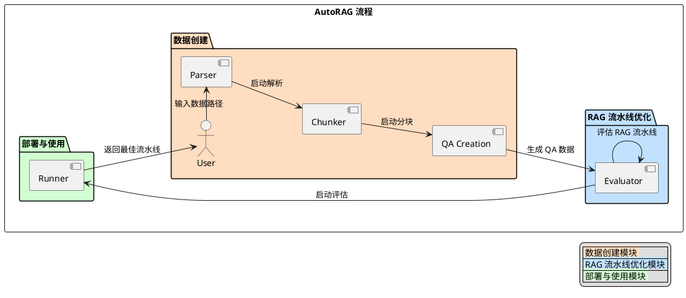

# AutoRAG项目解读报告


* 官方文档：https://docs.auto-rag.com/
* 仓库：https://github.com/Marker-Inc-Korea/AutoRAG
* 体验地址：https://huggingface.co/spaces/AutoRAG/Naive-RAG-chatbot

## 0. 简介

> 1. 概览

AutoRAG 是一个自动化机器学习工具，用于自动寻找最优的 RAG（Retrieval-Augmented Generation）流程，以适应用户的数据和用例。

> 2. 为什么选择 AutoRAG？
- 存在众多 RAG 流程和模块，但用户往往不知道哪个流程最适合自己的数据和用例。
- 手动制作和评估所有 RAG 模块耗时且困难。
- AutoRAG 旨在帮助用户自动评估不同 RAG 模块，并找到最适合自己用例的 RAG 流程。

> 3. AutoRAG 如何帮助？
- 数据创建：使用用户自己的原始文档创建 RAG 评估数据。
- 优化：自动运行实验以找到最适合用户数据的 RAG 流程。
- 部署：通过单一 YAML 文件部署最优 RAG 流程。

## 1. 项目的架构设计

AutoRAG 是一个致力于在您的数据上自动找到最佳 RAG（Retrieval Augmented Generation）流水线的工具。此工具自动评估各种 RAG 模块组合，以找到最佳的适用于您特定数据和使用案例的流水线。


```
@startuml
left to right direction

!define BASE_LAYER_COLOR #90EE90
!define COMMON_LAYER_COLOR #ADD8E6
!define APP_LAYER_COLOR #FFB6C1

rectangle "系统架构图" {
    package "基础层 (Base Layer)" BASE_LAYER_COLOR {
        [数据处理 data/] as DataProcessing
        [向量数据库 vectordb/] as VectorDB
        [工具类 utils/] as Utils
        [评估指标 evaluation/] as EvaluationMetrics
        [嵌入模型 embedding/] as EmbeddingModel
    }

    package "公共组件层 (Common Layer)" COMMON_LAYER_COLOR {
        [分块器 chunker] as Chunker
        [检索器 retrieval] as Retriever
        [重排序 reranker] as Reranker
        [生成器 generator] as Generator
        [评估器 evaluator] as Evaluator
    }

    package "应用层 (Application Layer)" APP_LAYER_COLOR {
        [API服务 deploy/api] as APIServer
        [仪表盘 dashboard] as Dashboard
        [命令行工具 cli] as CLI
    }
}

' 定义组件之间的连接关系
APIServer --> Retriever : 执行检索
APIServer --> Generator : 调用生成
Dashboard --> Evaluator : 获取评估结果

Chunker --> DataProcessing : 使用数据处理
Retriever --> VectorDB : 查询向量数据库
Retriever --> EmbeddingModel : 使用嵌入模型
Reranker --> EvaluationMetrics : 应用评估指标
Generator --> Utils : 使用工具类
Evaluator --> EvaluationMetrics : 评估基于指标

' 添加图例，解释颜色和模块含义
legend right
  |<back:BASE_LAYER_COLOR> 基础层 (Base Layer) |
  |<back:COMMON_LAYER_COLOR> 公共组件层 (Common Layer) |
  |<back:APP_LAYER_COLOR> 应用层 (Application Layer) |
endlegend
@enduml
```
AutoRAG 的核心流程包括：
- 数据创建：用于创建和处理 RAG 优化所需的数据集。
    - 解析、分块、QA对生成
- 流水线优化：用于评估和优化不同 RAG 模块组合，以找到最佳流水线。
    - 构建、评估、优化
- 部署与使用：提供将优化后的 RAG 流水线部署用于实际使用的途径。
    - 流水线的可动态配置、可视化、服务化




### 1.1. `data/` 包


```
@startuml
package "autorag.data" {
  
  ' 主要的解析模块
  class Parser {
    + data_path_glob: str
    + project_dir: str
    + start_parsing(yaml_path: str)
  }

  ' 基础解析器节点装饰器
  class parser_node << decorator >> {
    + wrapper()
  }

  ' 基础分块器节点装饰器  
  class chunker_node << decorator >> {
    + wrapper()
  }

  ' 解析器模块
  class langchain_parse {
    + {static} parse(data_path_list: List[str], parse_method: str)
  }

  class llama_parse {
    + {static} parse(data_path_list: List[str])
  }

  ' QA数据相关
  class QA {
    + data: pd.DataFrame
    + linked_corpus: Corpus
    + map()
    + make_retrieval_gt_contents()
    + to_parquet()
  }

  ' 分块模块
  class llama_index_chunk {
    + chunk(texts: List[str], chunker)
  }

  class langchain_chunk {
    + chunk(texts: List[str], chunker) 
  }

  ' 工具类
  class DataUtils {
    + {static} make_metadata_list()
    + {static} get_chunk_instance()
    + {static} load_yaml()
  }

  ' 关系
  Parser ..> parser_node
  Parser ..> langchain_parse
  Parser ..> llama_parse
  
  langchain_parse ..> parser_node
  llama_parse ..> parser_node
  
  llama_index_chunk ..> chunker_node
  langchain_chunk ..> chunker_node

  QA --> DataUtils
}
@enduml
```

`data/` 主要负责数据处理和转换的底层功能。具体分析如下：

1. 核心职责:
    - 文档解析(Parse)：支持多种格式文档的加载和解析
    - 文本分块(Chunk)：提供多种文本分块策略
    - 数据集处理(QA)：处理问答数据集的创建和管理
    - 工具支持(Utils)：提供通用工具函数

2. 设计模式:
    - 装饰器模式：使用`parser_node`和`chunker_node`装饰器统一处理输入输出
    - 工厂模式：通过字典注册不同的解析器和分块器实现

3. 外部依赖：
    - langchain、llama_index等第三方库

总的来说，`data/`包作为基础设施层，它：

1. 对上层提供统一的数据处理接口
2. 对下层封装各种第三方库的实现细节
3. 通过模块化和插件化设计保证了系统的可扩展性
4. 使用装饰器和工厂模式实现了统一的行为管理
5. 采用配置驱动的方式提供了灵活的使用方式

这种设计使得整个系统在数据处理层面具有良好的扩展性和维护性。

### 1.2. `deploy/` 包

```
@startuml
' 基类
abstract class BaseRunner {
  - config: Dict
  - module_instances: List
  - module_params: List
  + __init__(config: Dict, project_dir: str)
  + {static} from_yaml(yaml_path: str, project_dir: str): BaseRunner
}

' API Runner
class ApiRunner {
  - app: Quart
  - corpus_df: DataFrame
  + __init__(config: Dict, project_dir: str)
  + run_api_server(host: str, port: int, remote: bool)
  - __add_api_route()
  - extract_retrieve_passage(df: DataFrame): List[RetrievedPassage]
}

' Gradio Runner
class GradioRunner {
  + run_web(server_name: str, server_port: int, share: bool)
  + run(query: str, result_column: str): str
}

' 请求/响应模型
class QueryRequest {
  + query: str
  + result_column: str
}

class RunResponse {
  + result: Union[str, List[str]]
  + retrieved_passage: List[RetrievedPassage]
}

class StreamResponse {
  + type: str
  + generated_text: str
  + retrieved_passage: RetrievedPassage
  + passage_index: int
}

class RetrievedPassage {
  + content: str  
  + doc_id: str
  + filepath: str
  + file_page: int
  + start_idx: int
  + end_idx: int
}

class VersionResponse {
  + version: str
}

' 工具函数
class DeployUtils {
  + {static} extract_node_line_names(config_dict: Dict): List[str]
  + {static} extract_node_strategy(config_dict: Dict): Dict
  + {static} summary_df_to_yaml(summary_df: DataFrame, config_dict: Dict): Dict
  + {static} extract_best_config(trial_path: str, output_path: str)
}

' 关系
BaseRunner <|-- ApiRunner
BaseRunner <|-- GradioRunner

ApiRunner ..> QueryRequest: uses
ApiRunner ..> RunResponse: uses  
ApiRunner ..> StreamResponse: uses
ApiRunner ..> RetrievedPassage: uses
ApiRunner ..> VersionResponse: uses
@enduml
```

### 1.3. `evaluation/` 包


```
@startuml

package "evaluation" {
  
  class MetricInput {
    + retrieval_gt: List
    + generation_gt: str
    + query: str
    + queries: List[str]
  }

  interface BaseEvaluator {
    + {abstract} evaluate()
  }

  class RetrievalEvaluator {
    + evaluate_retrieval()
    - _evaluate_metrics()
  }

  class GenerationEvaluator {
    + evaluate_generation() 
    - _evaluate_metrics()
  }

  class RetrievalContentsEvaluator {
    + evaluate_retrieval_contents()
    - _evaluate_metrics() 
  }

  package "metric" {
    
    package "retrieval" {
      class RetrievalMetrics {
        + retrieval_f1()
        + retrieval_recall()
        + retrieval_precision()
        + retrieval_mrr()
        + retrieval_ndcg()
        + retrieval_map()
      }
    }

    package "generation" {
      class GenerationMetrics {
        + bleu()
        + meteor()
        + rouge()
        + sem_score()
        + g_eval()
        + bert_score()
        + deepeval_faithfulness()
      }
    }

    package "retrieval_contents" {
      class RetrievalContentsMetrics {
        + retrieval_token_f1()
        + retrieval_token_precision() 
        + retrieval_token_recall()
      }
    }
  }
}

BaseEvaluator <|-- RetrievalEvaluator
BaseEvaluator <|-- GenerationEvaluator  
BaseEvaluator <|-- RetrievalContentsEvaluator

RetrievalEvaluator --> RetrievalMetrics
GenerationEvaluator --> GenerationMetrics
RetrievalContentsEvaluator --> RetrievalContentsMetrics

MetricInput <-- RetrievalEvaluator
MetricInput <-- GenerationEvaluator
MetricInput <-- RetrievalContentsEvaluator

@enduml
```

### 1.4. `nodes` 包


```
@startuml

' 基础抽象类
abstract class BaseModule {
  + {abstract} pure(previous_result: DataFrame)
  + {abstract} _pure(*args, **kwargs)
  + {abstract} cast_to_run(previous_result: DataFrame)
  + run_evaluator(project_dir, previous_result)
}

' 节点基类
class Node {
  + node_type: str
  + strategy: Dict
  + node_params: Dict 
  + modules: List[Module]
  + run_node: Callable
  + get_param_combinations()
  + from_dict()
  + run()
}

' 模块类
class Module {
  + module_type: str
  + module_param: Dict
  + module: Callable
  + from_dict()
}

' Generator相关类
abstract class BaseGenerator {
  + llm: str
  + cast_to_run()
  + structured_output()
  + {abstract} astream()
  + {abstract} stream()
}

class OpenAILLM {
  + structured_output()
  + astream()
  + stream()
}

class LlamaIndexLLM {
}

class Vllm {
}

' PassageReranker相关类
abstract class BasePassageReranker {
  + cast_to_run()
}

class RankGPTRerank {
}

class AsyncRankGPTRerank {
  + async_run_llm()
  + async_postprocess_nodes()
}

class Tart {
}

' PassageCompressor相关类
abstract class BasePassageCompressor {
  + cast_to_run()
}

class TreeSummarize {
  + _pure()
}

' QueryExpansion相关类
abstract class BaseQueryExpansion {
  + generator
  + cast_to_run()
  + _check_expanded_query()
}

' PassageAugmenter相关类
abstract class BasePassageAugmenter {
  + corpus_df
  + cast_to_run()
  + sort_by_scores()
}

' 继承关系
BaseGenerator --|> BaseModule
BasePassageReranker --|> BaseModule
BasePassageCompressor --|> BaseModule
BaseQueryExpansion --|> BaseModule
BasePassageAugmenter --|> BaseModule

OpenAILLM --|> BaseGenerator
LlamaIndexLLM --|> BaseGenerator
Vllm --|> BaseGenerator

RankGPTRerank --|> BasePassageReranker
AsyncRankGPTRerank --|> RankGPTRerank
Tart --|> BasePassageReranker

TreeSummarize --|> BasePassageCompressor

' 关联关系
Node "1" *-- "many" Module
Node ..> BaseModule

@enduml
```

### 1.5. `schema` 包


```
@startuml

' 基础抽象类
abstract class BaseModule {
  + {abstract} pure(previous_result: DataFrame, *args, **kwargs)
  + {abstract} _pure(*args, **kwargs)
  + {abstract} cast_to_run(previous_result: DataFrame, *args, **kwargs)
  + {static} run_evaluator(project_dir: str, previous_result: DataFrame, *args, **kwargs)
}

' Module类
class Module {
  - module_type: str
  - module_param: Dict
  - module: Callable
  + __post_init__()
  + {static} from_dict(module_dict: Dict): Module
}

' Node类
class Node {
  - node_type: str
  - strategy: Dict  
  - node_params: Dict
  - modules: List[Module]
  - run_node: Callable
  + __post_init__()
  + get_param_combinations(): Tuple[List[Callable], List[Dict]]
  + {static} from_dict(node_dict: Dict): Node
  + run(previous_result: DataFrame, node_line_dir: str): DataFrame
}

' 类之间的关系
Node "1" *-- "many" Module : contains
Module --|> BaseModule : implements
Node --|> BaseModule : implements

note right of BaseModule
  抽象基类,定义了模块的基本接口
end note

note right of Module 
  具体模块实现,包装了实际的功能模块
end note

note right of Node
  节点类,组织和管理多个Module
end note

@enduml
```
### 1.6. `utils` 包


```
@startuml

package "autorag.utils" {
  
  class Utils {
    + fetch_contents()
    + result_to_dataframe()
    + sort_by_scores()
  }

  class Util {
    + load_summary_file()
    + explode()
    + load_yaml_config()
    + get_event_loop()
    + make_combinations()
    + process_batch()
    + apply_recursive()
    + dict_to_markdown()
    + dict_to_markdown_table()
    + pop_params()
    + empty_cuda_cache()
    + save_parquet_safe()
    + flatten_apply()
    + select_top_k()
  }

  class Preprocess {
    + validate_qa_dataset()
    + validate_corpus_dataset() 
    + cast_qa_dataset()
    + cast_corpus_dataset()
    + validate_qa_from_corpus_dataset()
  }

  class DataFrameDecorator {
    + result_to_dataframe()
    - _wrap_function()
    - _process_result()
  }

  Utils --> Util
  Utils --> Preprocess
  Util --> DataFrameDecorator

}

note right of Util
  提供各种通用工具函数
  包括文件处理、数据转换等
end note

note right of Preprocess  
  提供数据预处理相关函数
  主要用于验证和转换数据集
end note

note right of DataFrameDecorator
  装饰器类
  用于将函数返回值转换为DataFrame
end note

@enduml
```
### 1.7. `vectordb` 包


1. BaseVectorStore (基类):
    - 定义了向量数据库的基本接口
    - 包含embedding模型和相似度计算方法
    - 定义了增删改查等抽象方法
2. Chroma (实现类):
    - 基于ChromaDB的具体实现
    - 支持持久化和内存存储
    - 实现了所有基类定义的方法
3. Milvus (实现类):
    - 基于Milvus的具体实现
    - 支持分布式向量检索
    - 实现了所有基类方法并增加了一些特有功能
4. VectorDBUtils (工具类):
    - 提供了创建和加载向量数据库的静态方法
    - 支持从YAML配置文件加载
    - 管理向量数据库实例的生命周期

```
@startuml

' 基类
abstract class BaseVectorStore {
  + {static} support_similarity_metrics: List[str]
  + embedding: BaseEmbedding
  + embedding_batch: int
  + similarity_metric: str
  
  + {abstract} add(ids: List[str], texts: List[str])
  + {abstract} query(queries: List[str], top_k: int): Tuple[List[List[str]], List[List[float]]]
  + {abstract} fetch(ids: List[str]): List[List[float]]
  + {abstract} is_exist(ids: List[str]): List[bool]
  + {abstract} delete(ids: List[str])
  + truncated_inputs(inputs: List[str]): List[str]
}

' 具体实现类
class Chroma {
  - client: ChromaClient
  - collection: Collection
  + __init__(embedding_model: str, collection_name: str, ...)
  + add()
  + query()
  + fetch()
  + is_exist()
  + delete()
}

class Milvus {
  - collection: Collection
  - collection_name: str
  - timeout: float
  + __init__(embedding_model: str, collection_name: str, ...)
  + add()
  + query()
  + fetch()
  + is_exist() 
  + delete()
  + delete_collection()
}

' 工具函数
class VectorDBUtils {
  + {static} get_support_vectordb(vectordb_name: str)
  + {static} load_vectordb(vectordb_name: str, **kwargs)
  + {static} load_vectordb_from_yaml(yaml_path: str, vectordb_name: str, project_dir: str)
  + {static} load_all_vectordb_from_yaml(yaml_path: str, project_dir: str)
}

' 关系
BaseVectorStore <|-- Chroma
BaseVectorStore <|-- Milvus
VectorDBUtils ..> BaseVectorStore
VectorDBUtils ..> Chroma
VectorDBUtils ..> Milvus

@enduml
```

## 3. 设计模式和架构决策

- **设计模式**
  - **工厂模式**：在数据创建模块中使用工厂模式以根据不同的配置生成解析器和分块器实例。
  - **策略模式**：在流水线优化中使用策略模式，以根据不同的评估标准和优化策略，动态调整优化过程。
  - **单例模式**：在运行模块中实现单例模式以确保 API 服务的唯一性和一致性。

- **架构风格**
  - **模块化架构**：各个模块高度模块化，职责清晰，易于扩展和维护。
  - **面向服务**：通过 API 服务和命令行工具，提供简洁的接口供用户使用。

- **优缺点**
  - **优点**：
    - 模块化设计使系统具有较高的扩展性和可维护性。
    - 使用精准的数据生成和评估策略，提升了流水线优化的准确性。
    - 提供多种部署方式（API 服务和 Web 界面），方便用户灵活使用。
  - **缺点**：
    - 系统复杂度较高，初次使用需要一定的学习成本。
    - 对硬件和计算资源要求较高，特别是在进行大规模评估和优化时。

## 4. 总结和建议

- **亮点**
  - AutoRAG 提供了一整套自动化的 RAG 流水线优化方案，极大减轻了用户的手动评估负担。
  - 支持多种解析和分块模块，提供灵活的数据创建方案。
  - 接口简洁，用户可以通过命令行工具、API 服务和 Web 界面方便地使用该工具。

- **改进建议**
  - 提供更多的预配置模板和示例，帮助用户快速上手。
  - 增加详细的错误提示和日志记录，便于用户排查问题。
  - 在文档中详细说明各个配置项的含义，提升文档的易用性。
