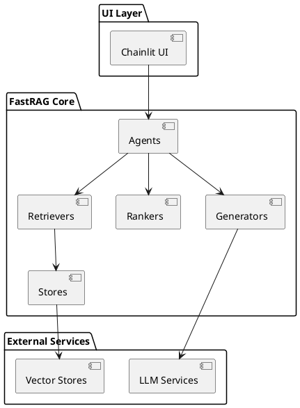
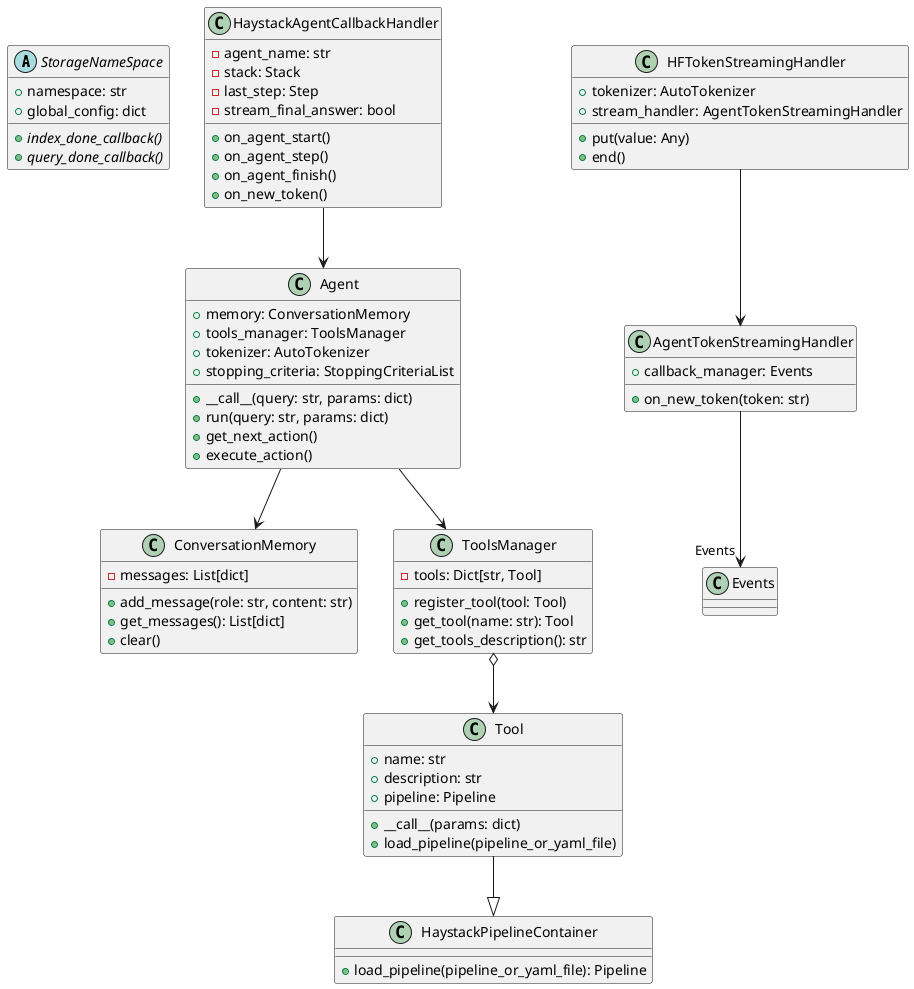
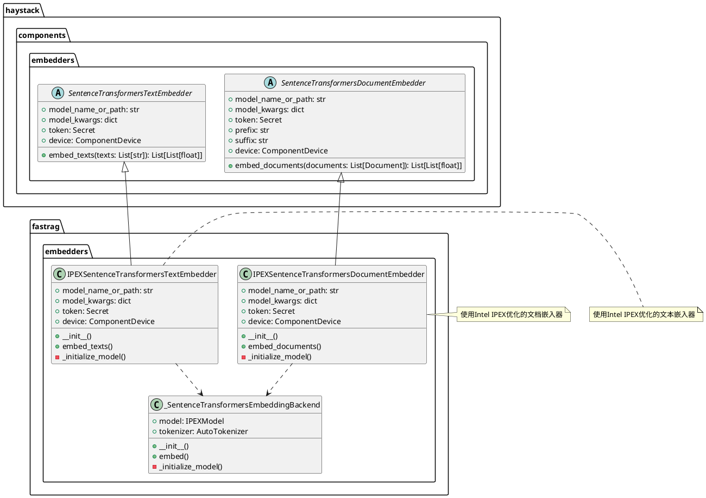
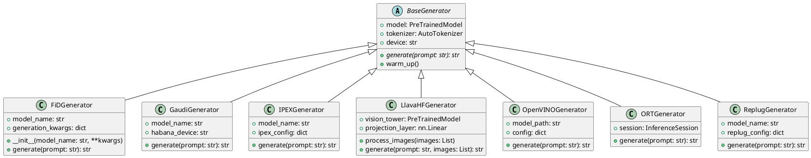
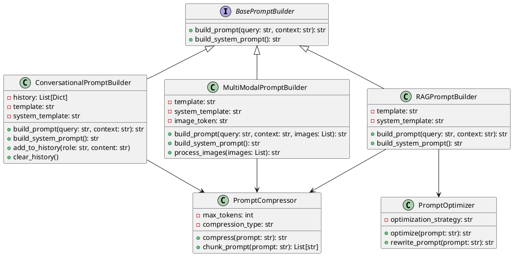
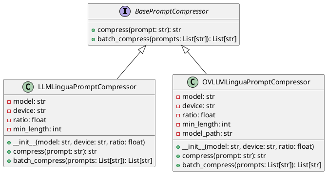
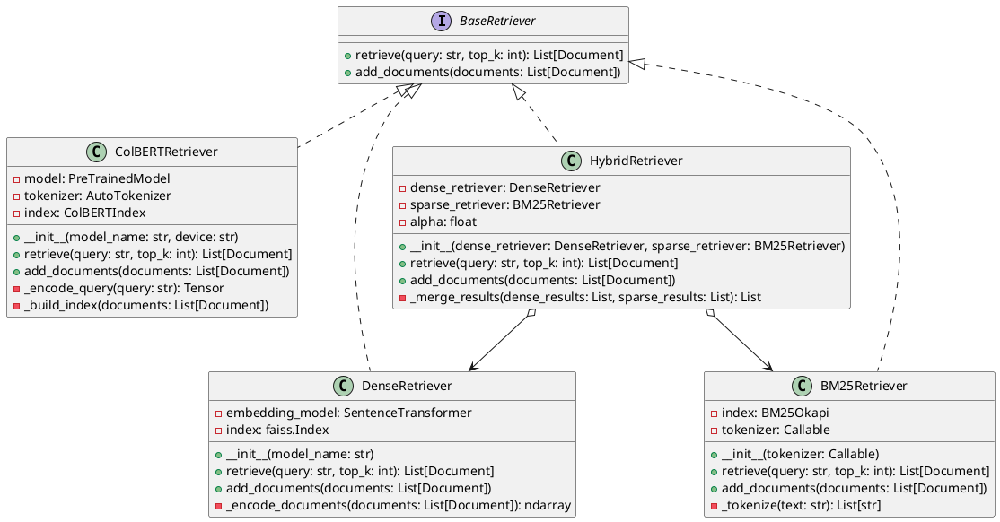
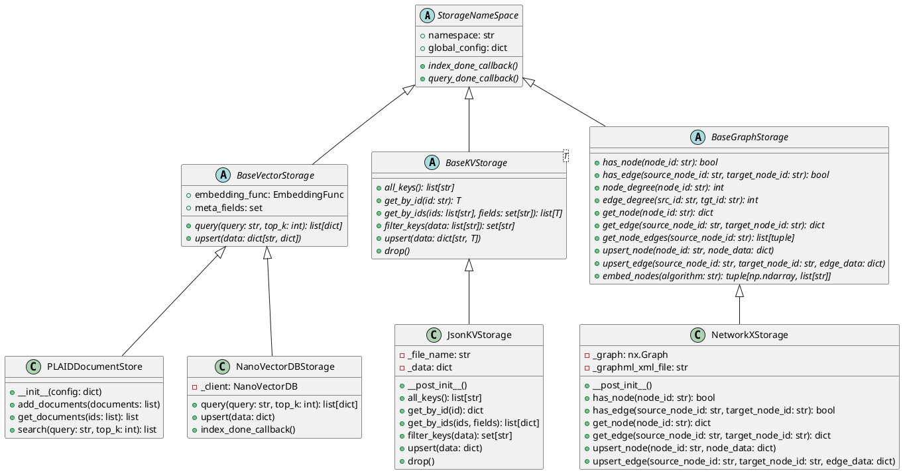
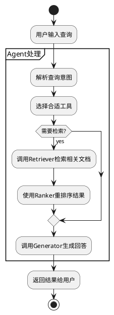

# fastRAG：构建和探索高效的检索增强生成模型和应用


## 0. 简介

### 主要特点
- **优化RAG**：使用SOTA高效组件构建RAG管道，以提高计算效率。
- **针对英特尔硬件进行了优化**：利用针对PyTorch（IPEX）的英特尔扩展、🤗最佳英特尔和🤗最佳哈瓦那在英特尔®至强®处理器和英特尔®高迪®人工智能加速器上尽可能最佳地运行。
- **可定制**：Fast RAG是使用Haystack和HuggingFace构建的。所有Fast RAG的组件都100%兼容Haystack。


## 1. 项目的架构设计

### 1.1 系统整体架构

fastRAG是一个基于Haystack框架的RAG系统实现，主要包含以下核心模块：




### 1.2 核心包的类图设计

#### 1.2.1 Agents包类图


类图主要展示了:

1. 核心组件:
    - Agent: 主要的agent类，负责协调工具和内存
    - ConversationMemory: 对话记忆管理
    - ToolsManager: 工具管理器
    - Tool: 基础工具类

2. 处理器组件:
    - AgentTokenStreamingHandler: Token流处理
    - HFTokenStreamingHandler: HuggingFace Token处理

3. 回调组件:
    - HaystackAgentCallbackHandler: 代理回调处理

4. 关键关系:
    - 组合关系: Agent与Memory/ToolsManager
    - 继承关系: Tool继承自HaystackPipelineContainer
    - 依赖关系: Handler之间的依赖

这个类图完整展示了agents包的核心架构和组件关系。


#### 1.2.2. embedders包类图



#### 1.2.2 Generators包类图


类图主要展示了:
1. 所有生成器继承自抽象基类 BaseGenerator
2. 每个具体生成器针对不同的硬件或框架进行了优化:
   - FiD: Fusion-in-Decoder生成
   - Gaudi: Habana Gaudi加速器支持
   - IPEX: Intel PyTorch扩展优化
   - Llava: 多模态(视觉-语言)生成
   - OpenVINO: Intel推理引擎优化
   - ORT: ONNX Runtime优化
   - Replug: 可插拔式生成器
3. 统一的生成接口设计,但支持不同的硬件加速和优化方案


#### 1.2.3. prompt_builders包


类图主要展示了prompt_builders包中的核心组件设计，包括:
1. 基础的提示词构建器接口(BasePromptBuilder)
2. 三种主要的提示词构建器实现(RAG/对话式/多模态)
3. 提示词压缩器(PromptCompressor)和优化器(PromptOptimizer)的辅助功能
4. 各个组件之间的继承和依赖关系，体现了提示词构建的模块化设计

#### 1.2.4. prompt_compressors包


类图主要展示了prompt_compressors包中的提示词压缩器类的层次结构。包含一个基础接口BasePromptCompressor定义了**压缩提示词的基本方法**，以及两个具体实现类**LLMLinguaPromptCompressor**和**OVLLMLinguaPromptCompressor**，它们分别实现了基于**LLMLingua**和**OpenVINO**优化的LLMLingua的提示词压缩功能。这种设计使得系统可以灵活切换不同的提示词压缩策略。


#### 1.2.5. rankers包


类图主要展示了:
1. Rankers包中的三个主要重排序器实现:BiEncoder、IPEX优化版BiEncoder和ColBERT
2. 它们共同实现的BaseRanker接口,提供rank()和score()方法
3. 各个Ranker与其依赖的外部组件(如Embedder、Tokenizer等)之间的关系
4. 每个具体Ranker的主要属性和方法
```
@startuml Rankers

' 基础接口
interface BaseRanker {
  + rank(documents: List[Document]): List[Document]
  + score(documents: List[Document]): List[float]
}

' 具体实现类
class BiEncoderSimilarityRanker {
  - model: SentenceTransformer
  - device: str
  - batch_size: int
  + __init__(model_name: str, device: str)
  + rank(documents: List[Document]): List[Document]
  + score(documents: List[Document]): List[float]
  - _compute_similarity(query_embedding: tensor, doc_embeddings: tensor): tensor
}

class IPEXBiEncoderSimilarityRanker {
  - model: SentenceTransformer
  - device: str
  - batch_size: int
  + __init__(model_name: str)
  + rank(documents: List[Document]): List[Document]
  + score(documents: List[Document]): List[float]
  - _optimize_for_ipex()
}

class ColBERTRanker {
  - model: ColBERT
  - tokenizer: AutoTokenizer
  - max_length: int
  + __init__(model_name: str, device: str)
  + rank(documents: List[Document]): List[Document]
  + score(documents: List[Document]): List[float]
  - _maxsim(query_tokens: tensor, doc_tokens: tensor): float
}

' 继承关系
BaseRanker <|.. BiEncoderSimilarityRanker
BaseRanker <|.. IPEXBiEncoderSimilarityRanker
BaseRanker <|.. ColBERTRanker

' 关联
BiEncoderSimilarityRanker --> "1" SentenceTransformersDocumentEmbedder: uses
IPEXBiEncoderSimilarityRanker --> "1" SentenceTransformersDocumentEmbedder: uses
ColBERTRanker --> "1" AutoTokenizer: uses

@enduml
```
#### 1.2.6. retrievers包


类图主要展示了:
1. 检索器的基础接口BaseRetriever定义了retrieve和add_documents两个核心方法
2. 四种主要的检索器实现:
   - ColBERTRetriever: 基于ColBERT模型的检索
   - DenseRetriever: 基于稠密向量的检索
   - BM25Retriever: 基于BM25算法的稀疏检索
   - HybridRetriever: 混合检索策略,组合了稠密和稀疏检索
3. HybridRetriever通过组合方式复用了DenseRetriever和BM25Retriever的功能
4. 每个检索器都实现了文档的添加和检索两个核心功能

#### 1.2.7. stores包


类图主要展示了:
1. 存储模块的三个核心抽象基类:BaseVectorStorage(向量存储)、BaseKVStorage(键值存储)和BaseGraphStorage(图存储)
2. 各个具体实现类如PLAIDDocumentStore、JsonKVStorage、NanoVectorDBStorage和NetworkXStorage的属性和方法
3. 存储类之间的继承关系,所有存储类都继承自StorageNameSpace基类
4. 每个存储类的主要功能接口和实现方法

---

### 1.3 核心功能流程图




# 2. 设计模式分析

- 工厂模式：在代码中发现工具创建使用了工厂模式
- 策略模式：在生成器实现中使用了策略模式，允许在运行时切换不同的生成策略
- 观察者模式：在UI回调中使用了观察者模式处理事件

## 3. 项目亮点
1. 基于Haystack框架构建,充分利用了其生态系统
2. 模块化设计清晰,各个组件职责单一
3. 支持多模态输入(文本+图像)
4. 提供了灵活的工具系统扩展机制