## 0. 简介

GraphRAG是一个由微软开发的开源项目，专注于图形增强生成（Graph-based Retrieval Augmented Generation，GraphRAG）。该项目提供了一个灵活的框架，用于集成图形检索和生成任务，支持多种模型和工作流的实现。

### 项目主要特点
- **模块化设计**：采用高度模块化的设计，各个组件之间通过清晰的接口进行交互。
- **灵活的配置系统**: 提供了强大的配置管理功能，支持多种配置方式和动态加载。
- **完整的工作流管理**: 包含索引、检索、生成等完整的工作流程支持。
- **多样化的集成选项**: 支持多种LLM模型、向量存储和检索策略的集成。

## 1. 项目的架构设计

### 1.1. 系统整体架构

GraphRAG的整体架构由多个模块组成，每个模块负责特定的功能：


```
@startuml
' 样式定义
skinparam package {
  BackgroundColor LightGrey
  BorderColor Black
}

skinparam component {
  BackgroundColor White
  BorderColor Black
}

' 顶层包
package "GraphRAG System" {
  ' API 层
  package "API Layer" {
    [Index API]
    [Query API]
    [Prompt Tune API]
    [CLI Interface]
  }

  ' 核心功能层
  package "Core Layer" {
    ' 索引子系统
    package "Index" {
      [Graph Extractor]
      [Community Reports]
      [Description Summarizer]
      [Pipeline Cache]
      [Pipeline Storage]
    }

    ' 查询子系统
    package "Query" {
      [Local Search]
      [Global Search]
      [DRIFT Search]
      [Question Generator]
    }

    ' LLM子系统
    package "LLM" {
      [OpenAI Integration]
      [Azure OpenAI Integration]
      [Mock LLM]
      [LLM Cache]
      [Rate Limiter]
    }

    ' 提示词调优子系统
    package "Prompt Tune" {
      [Template Manager]
      [Prompt Generator]
      [Input Loader]
    }
  }

  ' 基础设施层
  package "Infrastructure Layer" {
    ' 配置子系统
    package "Config" {
      [GraphRAG Config]
      [LLM Config]
      [Storage Config]
      [Cache Config]
    }

    ' 工具子系统
    package "Utils" {
      [CLI Utils]
      [Storage Utils]
      [Embedding Utils]
    }

    ' 日志子系统
    package "Logging" {
      [Status Logger]
      [Progress Reporter]
      [Console Reporter]
    }

    ' 回调子系统
    package "Callbacks" {
      [Workflow Callbacks]
      [LLM Callbacks]
      [Progress Callbacks]
    }
  }

  ' 数据模型层
  package "Model Layer" {
    [Entity]
    [Document]
    [TextUnit]
    [Relationship]
    [Community]
    [CommunityReport]
  }
}

' 定义主要依赖关系
"API Layer" --> "Core Layer"
"Core Layer" --> "Infrastructure Layer"
"Core Layer" --> "Model Layer"

[Index API] --> [Graph Extractor]
[Query API] --> [Local Search]
[Query API] --> [Global Search]
[Prompt Tune API] --> [Template Manager]

[Graph Extractor] --> [OpenAI Integration]
[Local Search] --> [OpenAI Integration]
[Global Search] --> [OpenAI Integration]

[OpenAI Integration] --> [Rate Limiter]
[OpenAI Integration] --> [LLM Cache]

[GraphRAG Config] --> [LLM Config]
[GraphRAG Config] --> [Storage Config]

[Status Logger] --> [Console Reporter]
[Progress Reporter] --> [Console Reporter]
@enduml
```

### 1.2. 核心包的类图设计
### 1.2.1. **API模块**
提供外部访问接口，封装核心功能。


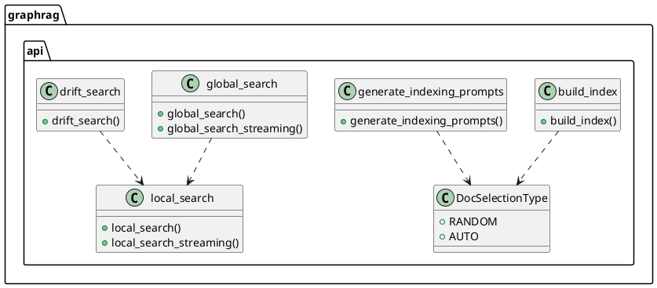

类图主要展示了:
1. GraphRAG API 包中的主要功能模块,包括索引构建(build_index)、提示词生成(generate_indexing_prompts)、全局搜索(global_search)、局部搜索(local_search)和漂移搜索(drift_search)等核心功能
2. DocSelectionType 枚举类型被索引构建和提示词生成模块使用
3. 搜索相关的功能模块之间存在依赖关系,全局搜索和漂移搜索都依赖于局部搜索的实现

### 1.2.2. **回调模块（Callbacks）**
定义各种回调，用于工作流的扩展和监控。


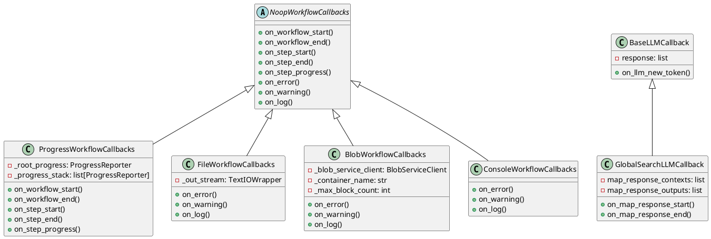

【类图主要展示了】:
1. 回调系统的继承层次结构，其中 NoopWorkflowCallbacks 作为基类被多个具体实现继承
2. 不同类型的工作流回调实现，包括进度报告(Progress)、文件日志(File)、Blob存储(Blob)和控制台输出(Console)
3. LLM相关的回调体系，包括基础的 BaseLLMCallback 和专门用于全局搜索的 GlobalSearchLLMCallback
4. 每个回调类都有其特定的职责和相应的回调方法实现

### 1.2.3. **CLI模块**
提供命令行接口，便于用户交互。


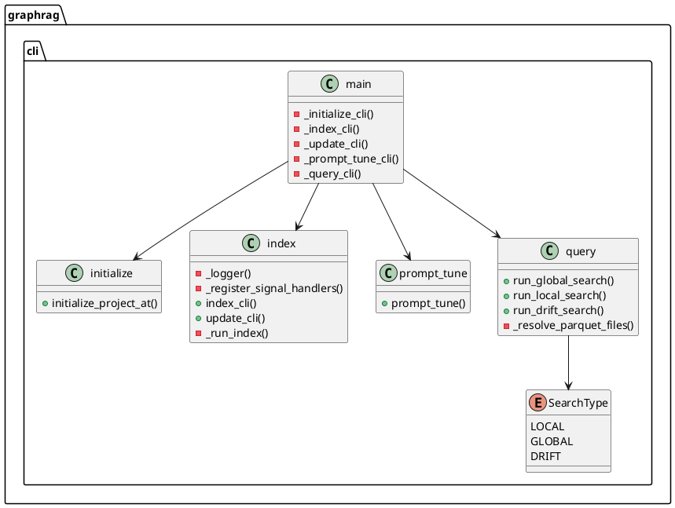

【类图主要展示了】:
1. GraphRAG CLI包的主要模块结构,包括main、initialize、index、prompt_tune和query五个主要类
2. main类作为入口点,通过命令行参数调用其他模块的功能
3. query模块包含三种搜索类型的实现,通过SearchType枚举进行区分
4. 各个模块之间的依赖关系清晰可见,形成了一个层次分明的CLI工具架构

### 1.2.4. **配置模块（Config）**
负责加载和管理系统配置。


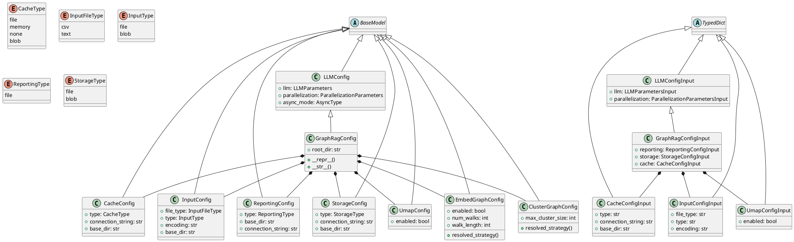

【类图主要展示了GraphRag配置系统的核心架构，包含以下几个主要部分:
1. 基于BaseModel的配置模型层次结构,以GraphRagConfig为根
2. 基于TypedDict的输入模型层次结构,以GraphRagConfigInput为根
3. 各种配置类型的枚举定义(CacheType、InputType等)
4. 配置模型与输入模型之间的关系
5. 各个配置组件(Cache、Input、Storage等)的属性和方法】

### 1.2.5. **索引模块（Index）**
管理数据索引和检索操作。


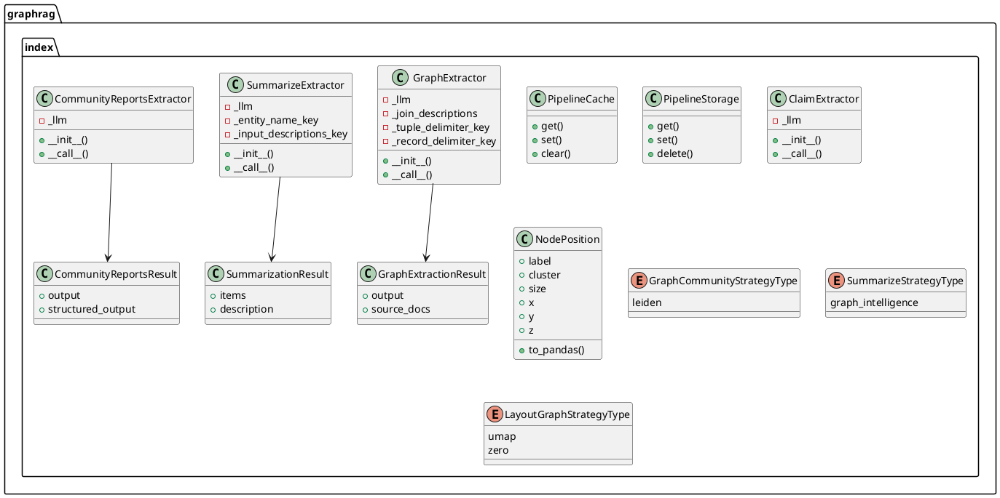

类图主要展示了:
1. graphrag.index 包中的核心类和它们之间的关系
2. 主要包含了几个关键的提取器类(Extractor)、结果类(Result)、配置类(Config)和枚举类型
3. 展示了数据处理管道中的缓存(Cache)和存储(Storage)组件
4. 展示了图形布局和社区检测相关的类型定义

### 1.2.6. **LLM模块**
处理大语言模型相关的任务。


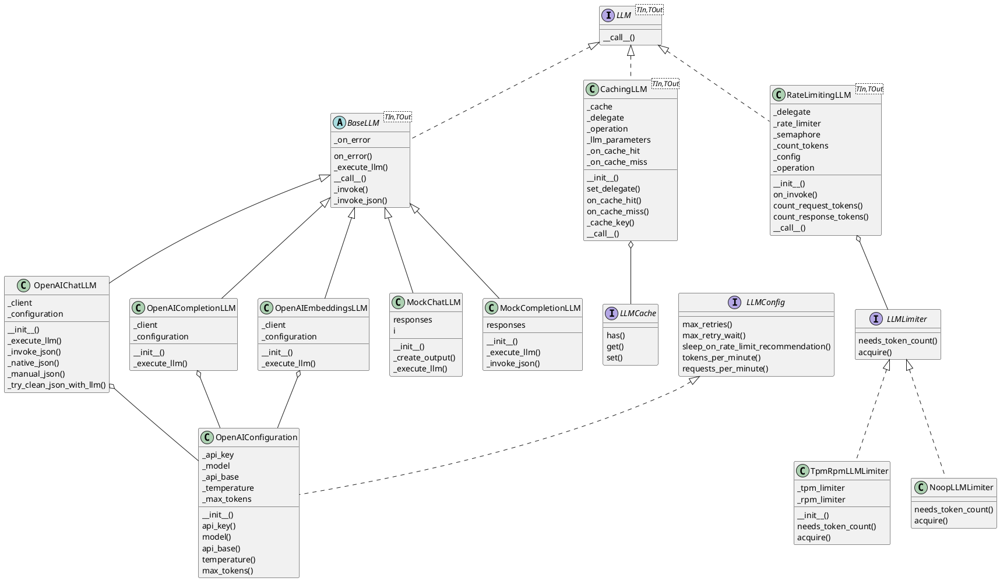

【类图主要展示了】:

1. LLM 包的核心接口设计:LLM、LLMConfig、LLMCache、LLMLimiter
2. 基础抽象类 BaseLLM 及其派生的具体 LLM 实现类(OpenAI系列和Mock系列)
3. 两个重要的装饰器类 CachingLLM 和 RateLimitingLLM,用于增强基础 LLM 功能
4. OpenAI 相关的配置类和限流器实现类
5. 类之间的继承关系和组合关系,展示了整个包的架构设计

### 1.2.7. **日志模块（Logging）**
提供日志记录和管理功能。


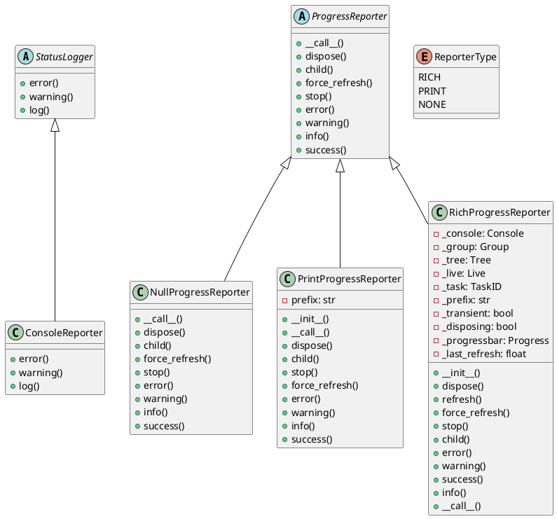

类图主要展示了logging包中的核心类结构，包括两个抽象基类 StatusLogger 和 ProgressReporter，以及它们的具体实现类。其中 ReporterType 枚举类定义了进度报告器的类型。ConsoleReporter 实现了基础的控制台日志功能，而 NullProgressReporter、PrintProgressReporter 和 RichProgressReporter 则分别实现了不同风格的进度报告功能。

### 1.2.8. **模型模块（Model）**
定义和管理机器学习模型。


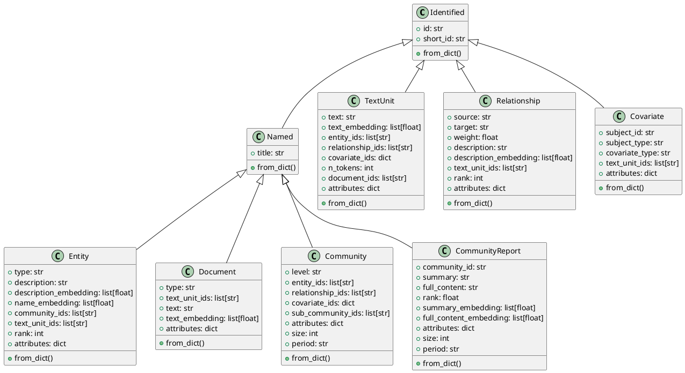

【类图主要展示了】:
1. 一个基于继承的数据模型层次结构,其中`Identified`和`Named`作为基类
2. 展示了9个主要的数据模型类,包括实体(Entity)、文档(Document)、文本单元(TextUnit)、关系(Relationship)、社区(Community)等
3. 每个类都包含了其特有的属性和通用的from_dict()方法
4. 类之间通过继承关系进行关联,形成了一个完整的知识图谱数据模型体系

### 1.2.9. **提示调优模块（Prompt Tune）**
支持提示的微调和优化。


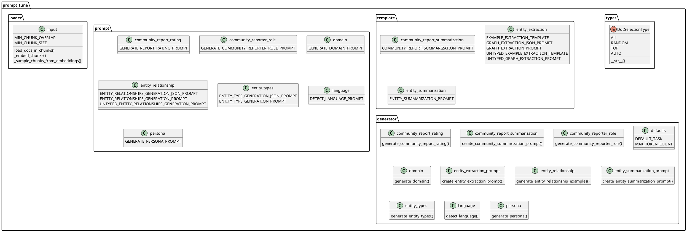

【类图主要展示了】:
1. prompt_tune 包的整体结构,包含5个主要子包:types、template、prompt、generator和loader
2. types包含DocSelectionType枚举类
3. template包含3个模板类,定义了各种提示模板常量
4. prompt包含7个提示类,定义了不同场景的提示常量
5. generator包含11个生成器类,实现了各种提示生成的功能
6. loader包含input类,实现了文档加载和处理功能

整体反映了该包是一个用于提示词调优的模块,通过模板、提示和生成器的组合来实现不同场景下的提示词生成和处理。

### 1.2.10. **查询模块（Query）**
处理用户查询并返回结果。


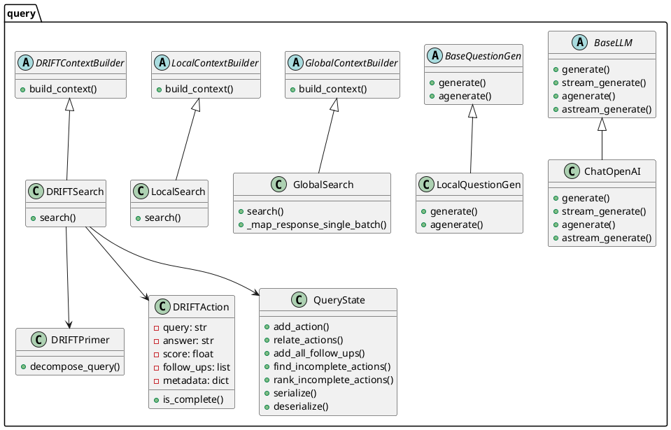

【类图主要展示了】:
1. query模块的主要类结构,包含了几个重要的抽象基类(BaseLLM、BaseQuestionGen、GlobalContextBuilder等)
2. 具体实现类(ChatOpenAI、LocalQuestionGen、GlobalSearch等)之间的继承关系
3. DRIFT搜索相关的核心类(DRIFTSearch、DRIFTPrimer、DRIFTAction、QueryState)及其关联关系
4. 整体反映了该模块采用了基于抽象类的设计模式,实现了搜索、问题生成等不同功能的解耦

### 1.2.11. **实用工具模块（Utils）**
提供通用的辅助功能。


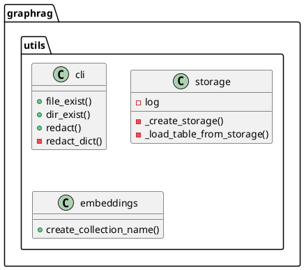

【类图主要展示了】：
- utils 包中包含三个主要模块：cli、storage 和 embeddings
- cli 模块提供命令行相关的工具函数，包括文件/目录检查和配置信息脱敏
- storage 模块处理存储相关的功能，提供创建存储和加载表格的功能
- embeddings 模块提供嵌入向量相关的工具函数，主要用于创建和管理集合名称
# 2. 设计模式分析

GraphRAG采用了多种设计模式：

- **工厂模式**：用于创建各种组件实例，确保组件创建过程的一致性。
- **策略模式**：实现不同的检索和生成策略，允许在运行时选择具体实现。
- **观察者模式**：通过回调机制实现工作流的监控和响应。

这些设计模式提高了系统的灵活性和可维护性。

## 3. 项目亮点

- **模块化设计**：使得不同组件可以独立开发和替换，增强了系统的可维护性。
- **丰富的回调机制**：支持实时监控和调整工作流，提升了用户体验。
- **强大的配置管理**：提供详细的配置选项，支持用户自定义和扩展。

潜在的改进空间包括：
- 增强文档和用户指南，以便于新用户上手。
- 提高代码的可读性和适应性，以便于社区贡献者的参与。