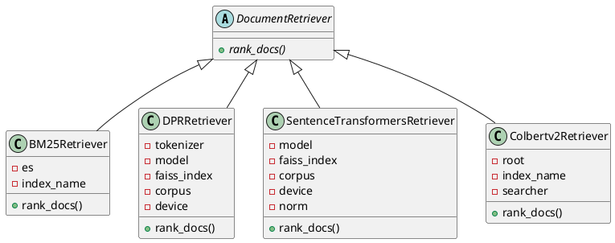
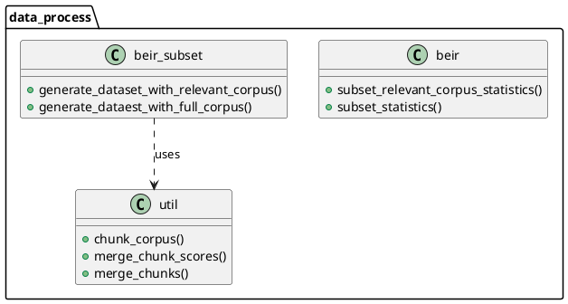
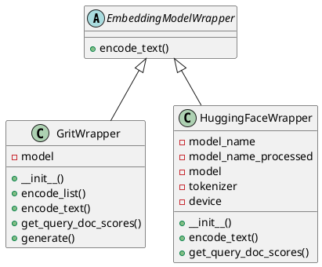
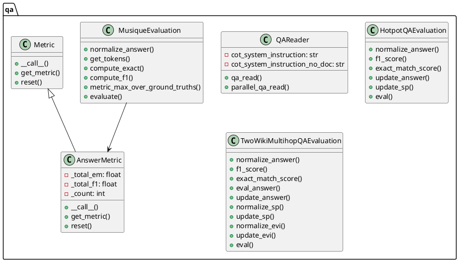

# HippoRAG 项目解读报告

## 0. 简介

### 项目背景
HippoRAG 是一个受人类长期记忆神经生物学启发的检索增强生成(RAG)框架。该项目旨在帮助大语言模型(LLMs)持续整合外部文档中的知识。

### 项目主要特点
- 神经生物学启发的知识整合方法
- 支持多种LLM接口(OpenAI、Together AI等)
- 灵活的检索架构(ColBERTv2、Contriever等)
- 支持单步和多步推理
- 提供详细的评估指标

## 1. 项目的架构设计

### 1.1. 核心包的类图设计

#### baselines包类图




【类图主要展示了】:
1. DocumentRetriever作为抽象基类,定义了rank_docs抽象方法
2. 四个具体的检索器实现类:
   - BM25Retriever: 基于ElasticSearch的BM25检索
   - DPRRetriever: 基于DPR(Dense Passage Retrieval)的检索
   - SentenceTransformersRetriever: 基于Sentence Transformers的检索
   - Colbertv2Retriever: 基于ColBERT v2的检索
3. 所有具体检索器都继承自DocumentRetriever抽象类,实现了rank_docs方法

这个类图展示了一个典型的策略模式设计,通过抽象基类统一接口,允许在运行时灵活切换不同的检索策略。

#### data_process包类图




【类图主要展示了】:
1. data_process包中包含三个主要类：beir、beir_subset和util
2. beir类负责处理语料库统计相关功能
3. beir_subset类负责生成数据集，包括相关语料库和完整语料库的处理
4. util类提供了通用工具函数，如文本分块和合并功能
5. beir_subset依赖于util类提供的功能

这个包的主要功能是处理BEIR数据集，进行数据预处理和转换。

#### lm_wrapper包类图




【类图主要展示了】：
1. 一个抽象基类 `EmbeddingModelWrapper`，定义了 `encode_text` 抽象方法
2. 两个具体实现类：`GritWrapper` 和 `HuggingFaceWrapper`，它们都继承自 `EmbeddingModelWrapper`
3. 每个具体类都实现了自己的特定功能和方法，用于处理不同类型的模型封装

#### qa包类图




【类图主要展示了qa包中的几个主要类:
1. QAReader - 负责问答读取和处理的核心类
2. 三个评估类(HotpotQA/TwoWikiMultihop/Musique) - 负责不同数据集的评估逻辑
3. Metric抽象类及其实现类AnswerMetric - 提供评估指标的计算功能】

### 1.2. 系统整体架构
从代码和类图中可以看出,HippoRAG主要包含以下几个核心模块:

1. baselines - 检索基线模块
2. data_process - 数据处理模块  
3. lm_wrapper - 语言模型封装模块
4. qa - 问答评估模块

下面是整合后的系统架构图的PlantUML代码:

```plantuml
@startuml HippoRAG System Architecture

package "HippoRAG Core" {
  class HippoRAG {
    + __init__()
    + rank_docs()
    + get_passage_by_idx()
    + build_graph()
    + load_node_vectors()
    + get_dpr_doc_embedding()
    + run_pagerank_igraph_chunk()
    + link_node_by_colbertv2()
    + link_node_by_dpr()
  }
}

package "Retrieval Module" {
  abstract class DocumentRetriever {
    + {abstract} rank_docs()
  }

  class BM25Retriever {
    - es
    - index_name
    + rank_docs()
  }

  class DPRRetriever {
    - tokenizer
    - model
    - faiss_index 
    - corpus
    + rank_docs()
  }

  class SentenceTransformersRetriever {
    - model
    - faiss_index
    - corpus
    + rank_docs() 
  }

  class Colbertv2Retriever {
    - root
    - index_name
    - searcher
    + rank_docs()
  }
}

package "Language Model Module" {
  abstract class EmbeddingModelWrapper {
    + encode_text()
  }

  class GritWrapper {
    - model
    + encode_text()
    + get_query_doc_scores()
    + generate()
  }

  class HuggingFaceWrapper {
    - model_name
    - model
    - tokenizer
    + encode_text()
    + get_query_doc_scores()
  }
}

package "Data Processing Module" {
  class DataProcessor {
    + beir {
      + subset_relevant_corpus_statistics()
      + subset_statistics()
    }
    + beir_subset {
      + generate_dataset_with_relevant_corpus()
      + generate_dataest_with_full_corpus() 
    }
    + util {
      + chunk_corpus()
      + merge_chunk_scores()
      + merge_chunks()
    }
  }
}

package "QA Module" {
  class QAReader {
    - cot_system_instruction
    + qa_read()
    + parallel_qa_read()
  }

  abstract class Metric {
    + __call__()
    + get_metric()
    + reset()
  }

  class AnswerMetric {
    - _total_em
    - _total_f1
    - _count
    + __call__()
    + get_metric()
    + reset()
  }

  class QAEvaluation {
    + normalize_answer()
    + f1_score()
    + exact_match_score()
    + eval()
  }
}

' Relationships
HippoRAG --> DocumentRetriever
HippoRAG --> EmbeddingModelWrapper
HippoRAG --> QAReader

DocumentRetriever <|-- BM25Retriever
DocumentRetriever <|-- DPRRetriever
DocumentRetriever <|-- SentenceTransformersRetriever  
DocumentRetriever <|-- Colbertv2Retriever

EmbeddingModelWrapper <|-- GritWrapper
EmbeddingModelWrapper <|-- HuggingFaceWrapper

Metric <|-- AnswerMetric
QAEvaluation --> AnswerMetric

@enduml
```

这个系统架构图展示了HippoRAG的主要组件和它们之间的关系:

1. HippoRAG Core作为核心类,整合了其他所有模块的功能

2. Retrieval Module包含了多种检索器实现:
- BM25Retriever
- DPRRetriever  
- SentenceTransformersRetriever
- Colbertv2Retriever

3. Language Model Module提供了语言模型的封装:
- GritWrapper
- HuggingFaceWrapper 

4. Data Processing Module负责数据处理:
- beir数据集处理
- 语料库分块等工具函数

5. QA Module处理问答和评估:
- QAReader进行问答
- 各种评估指标的计算

这个架构设计体现了良好的模块化和可扩展性,可以方便地添加新的检索器、语言模型或评估指标。

## 2. 设计模式分析

1. 工厂模式
    - 用于创建不同的语言模型和检索器实例
    - 优点:解耦具体实现,便于扩展
    - 缺点:增加了系统复杂度

2. 策略模式
    - 用于切换不同的检索策略和图算法
    - 优点:算法可以独立变化,便于维护
    - 缺点:客户端需要了解不同策略

3. 适配器模式
    - 用于统一不同LLM接口
    - 优点:统一接口,便于集成
    - 缺点:可能损失部分特性

4. 观察者模式
    - 用于日志记录和评估指标收集
    - 优点:解耦核心逻辑和监控逻辑
    - 缺点:可能影响性能

## 3. 项目亮点

### 创新点
1. 神经生物学启发的架构设计
    - 模拟人类记忆系统的工作机制
    - 实现高效的知识整合和检索

2. 灵活的检索框架
    - 支持多种检索模型
    - 可以根据需求选择合适的策略

3. 多步推理能力
    - 支持复杂问题的分解和推理
    - 提高答案的准确性

4. 高度可扩展性
    - 模块化设计便于扩展
    - 支持多种LLM和检索模型

### 改进空间
1. 本地部署支持
    - 增加更多本地LLM支持
    - 优化本地部署性能

2. 提示词灵活性
    - 增加提示词模板系统
    - 支持自定义提示词策略

3. 图数据库支持
    - 集成主流图数据库
    - 提供图数据的读写API

4. 性能优化
    - 优化大规模图计算
    - 提高检索效率