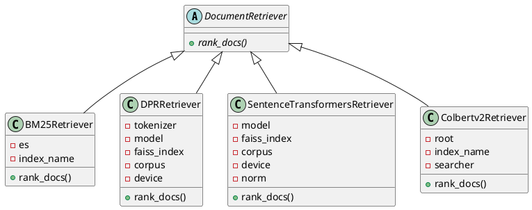
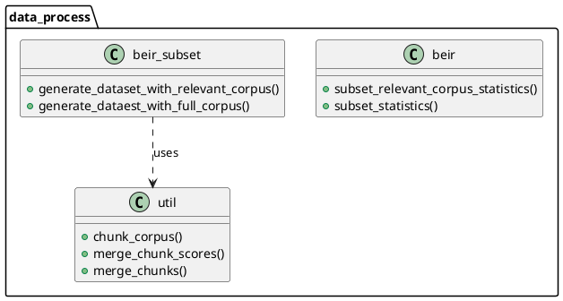
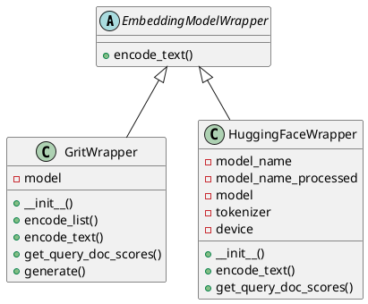
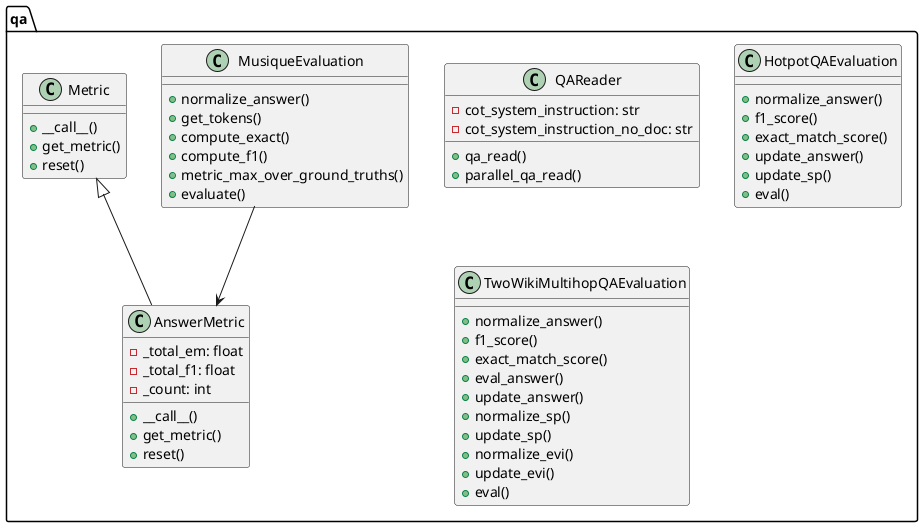

# 【论文解读】HippoRAG：模拟人类记忆机制的高效信息检索🔍
## 1. 核心方法

**HippoRAG**受**海马体记忆索引理论**启发，通过模拟人类的**模式分离**与**模式完成**来实现高效的信息索引与检索。


### 1.1. 核心组件

1. **离线索引**（Analogous to Memory Encoding）
   - 使用**指令调整的大规模语言模型（LLM）**提取**知识图谱（KG）三元组**，即【主语，谓语，宾语】。
   - 通过**开放信息抽取（OpenIE）**，将文本转化为离散的名词短语，增强**模式分离**。
   - 引入**检索编码器**，基于余弦相似度在KG中添加同义关系，构建**海马体索引**。

2. **在线检索**（Analogous to Memory Retrieval）
   - **LLM**从查询中提取**命名实体**，作为**查询节点**。
   - 使用**检索编码器**链接查询节点与KG中的相关节点。
   - 应用**个性化PageRank（Personalized PageRank, PPR）**算法，在KG中进行上下文相关的**模式完成**，返回相关的检索结果。

### 1.2. 关键公式

**个性化PageRank**的概率分布更新公式：

$$
\mathbf{p}' = \alpha \cdot M \cdot \mathbf{p} + (1 - \alpha) \cdot \mathbf{v}
$$

其中：
- $\alpha$ 是阻尼因子
- $M$ 是转移矩阵
- $\mathbf{v}$ 是个性化向量

### 数学推导

**Personalized PageRank (PPR)** 通过以下步骤实现节点的重要性计算：

1. **初始化**个性化向量 $\mathbf{v}$，仅在查询节点位置为1，其他为0。
2. **迭代更新**概率分布：
   $$
   \mathbf{p}_{t+1} = \alpha \cdot M \cdot \mathbf{p}_t + (1 - \alpha) \cdot \mathbf{v}
   $$
3. **收敛**到稳定的概率分布 $\mathbf{p}^*$，用于排名和检索。

### 节点特异性

**节点特异性** $s_i$ 定义为：

$$
s_i = \frac{1}{|P_i|}
$$

其中，$|P_i|$ 是节点 $i$ 出现的文档数量。通过将 **节点特异性** 与 PPR 概率分布相乘，提升稀有节点的权重，增强检索效果。

## 3 实验设置 📊

### 3.1 数据集

主要在两个具有挑战性的多跳问答基准数据集上评估的方法的检索能力，分别是 **MuSiQue (answerable)**  和 **2WikiMultiHopQA** 。为了完整性，尽管 **HotpotQA** 被认为是多跳推理的一个较弱的测试，因为它包含许多虚假信号，还是将其纳入实验中。为了限制实验成本，从每个验证集中提取 1,000 个问题。为了创建一个更现实的检索设置，遵循 IRCoT 的方法，收集所有候选段落（包括支持和干扰段落）并为每个数据集形成一个检索语料库。这些数据集的详细信息见下表，关于每个 1,000 个问题开发集的检索语料库和提取的 KG 统计信息。

### 3.2 基线方法

与几种强大且广泛使用的检索方法进行比较，包括 **BM25**、**Contriever**、**GTR** 和 **ColBERTv2**。此外，还与两个最近的 LLM 增强基线进行比较：**Propositionizer**，它将段落重写为命题，以及 **RAPTOR**，它构建摘要节点以简化从长文档中检索信息。除了上述单步检索方法外，还将多步检索方法 **IRCoT** 作为基线。

### 3.3 评估指标

使用 **recall@2** 和 **recall@5** (R@2 和 R@5) 来评估检索性能，使用 **exact match (EM)** 和 **F1 scores** 来评估问答性能。

### 3.4 实现细节

默认情况下，使用 **GPT-3.5-turbo-1106** [42] 作为 LLM L，温度设为 0，使用 **Contriever** [27] 或 **ColBERTv2** [53] 作为检索器 M。使用 MuSiQue 训练数据中的 100 个示例来调整 HippoRAG 的两个超参数：同义词阈值 τ 为 0.8 和 PPR 阻尼因子为 0.5，后者决定了 PPR 从查询节点重新开始随机游走的概率，而不是继续探索图。总体上，发现 HippoRAG 的性能对其超参数较为稳健。更多实现细节见附录 H。

## 4 实验结果与分析 📊

### 4.1 单步检索性能

单步检索性能。

HippoRAG 在 MuSiQue 和 2WikiMultiHopQA 上的性能优于所有基线，在较简单的 HotpotQA 数据集上也达到了可比较的性能。

### 4.2 多步检索性能

将 HippoRAG 与标准的多步检索方法（如 IRCoT）结合使用，可以在所有三个数据集上显著提高性能，见下表。


---

# HippoRAG 项目解读报告

## 0. 简介

### 项目背景
HippoRAG 是一个受人类长期记忆神经生物学启发的检索增强生成(RAG)框架。该项目旨在帮助大语言模型(LLMs)持续整合外部文档中的知识。

### 项目主要特点
- 神经生物学启发的知识整合方法
- 支持多种LLM接口(OpenAI、Together AI等)
- 灵活的检索架构(ColBERTv2、Contriever等)
- 支持单步和多步推理
- 提供详细的评估指标

## 1. 项目的架构设计

### 1.1. 核心包的类图设计

#### baselines包类图




【类图主要展示了】:
1. DocumentRetriever作为抽象基类,定义了rank_docs抽象方法
2. 四个具体的检索器实现类:
   - BM25Retriever: 基于ElasticSearch的BM25检索
   - DPRRetriever: 基于DPR(Dense Passage Retrieval)的检索
   - SentenceTransformersRetriever: 基于Sentence Transformers的检索
   - Colbertv2Retriever: 基于ColBERT v2的检索
3. 所有具体检索器都继承自DocumentRetriever抽象类,实现了rank_docs方法

这个类图展示了一个典型的策略模式设计,通过抽象基类统一接口,允许在运行时灵活切换不同的检索策略。

#### data_process包类图




【类图主要展示了】:
1. data_process包中包含三个主要类：beir、beir_subset和util
2. beir类负责处理语料库统计相关功能
3. beir_subset类负责生成数据集，包括相关语料库和完整语料库的处理
4. util类提供了通用工具函数，如文本分块和合并功能
5. beir_subset依赖于util类提供的功能

这个包的主要功能是处理BEIR数据集，进行数据预处理和转换。

#### lm_wrapper包类图




【类图主要展示了】：
1. 一个抽象基类 `EmbeddingModelWrapper`，定义了 `encode_text` 抽象方法
2. 两个具体实现类：`GritWrapper` 和 `HuggingFaceWrapper`，它们都继承自 `EmbeddingModelWrapper`
3. 每个具体类都实现了自己的特定功能和方法，用于处理不同类型的模型封装

#### qa包类图




【类图主要展示了qa包中的几个主要类:
1. QAReader - 负责问答读取和处理的核心类
2. 三个评估类(HotpotQA/TwoWikiMultihop/Musique) - 负责不同数据集的评估逻辑
3. Metric抽象类及其实现类AnswerMetric - 提供评估指标的计算功能】

### 1.2. 系统整体架构
从代码和类图中可以看出,HippoRAG主要包含以下几个核心模块:

1. baselines - 检索基线模块
2. data_process - 数据处理模块  
3. lm_wrapper - 语言模型封装模块
4. qa - 问答评估模块

下面是整合后的系统架构图的PlantUML代码:

```plantuml
@startuml HippoRAG System Architecture

package "HippoRAG Core" {
  class HippoRAG {
    + __init__()
    + rank_docs()
    + get_passage_by_idx()
    + build_graph()
    + load_node_vectors()
    + get_dpr_doc_embedding()
    + run_pagerank_igraph_chunk()
    + link_node_by_colbertv2()
    + link_node_by_dpr()
  }
}

package "Retrieval Module" {
  abstract class DocumentRetriever {
    + {abstract} rank_docs()
  }

  class BM25Retriever {
    - es
    - index_name
    + rank_docs()
  }

  class DPRRetriever {
    - tokenizer
    - model
    - faiss_index 
    - corpus
    + rank_docs()
  }

  class SentenceTransformersRetriever {
    - model
    - faiss_index
    - corpus
    + rank_docs() 
  }

  class Colbertv2Retriever {
    - root
    - index_name
    - searcher
    + rank_docs()
  }
}

package "Language Model Module" {
  abstract class EmbeddingModelWrapper {
    + encode_text()
  }

  class GritWrapper {
    - model
    + encode_text()
    + get_query_doc_scores()
    + generate()
  }

  class HuggingFaceWrapper {
    - model_name
    - model
    - tokenizer
    + encode_text()
    + get_query_doc_scores()
  }
}

package "Data Processing Module" {
  class DataProcessor {
    + beir {
      + subset_relevant_corpus_statistics()
      + subset_statistics()
    }
    + beir_subset {
      + generate_dataset_with_relevant_corpus()
      + generate_dataest_with_full_corpus() 
    }
    + util {
      + chunk_corpus()
      + merge_chunk_scores()
      + merge_chunks()
    }
  }
}

package "QA Module" {
  class QAReader {
    - cot_system_instruction
    + qa_read()
    + parallel_qa_read()
  }

  abstract class Metric {
    + __call__()
    + get_metric()
    + reset()
  }

  class AnswerMetric {
    - _total_em
    - _total_f1
    - _count
    + __call__()
    + get_metric()
    + reset()
  }

  class QAEvaluation {
    + normalize_answer()
    + f1_score()
    + exact_match_score()
    + eval()
  }
}

' Relationships
HippoRAG --> DocumentRetriever
HippoRAG --> EmbeddingModelWrapper
HippoRAG --> QAReader

DocumentRetriever <|-- BM25Retriever
DocumentRetriever <|-- DPRRetriever
DocumentRetriever <|-- SentenceTransformersRetriever  
DocumentRetriever <|-- Colbertv2Retriever

EmbeddingModelWrapper <|-- GritWrapper
EmbeddingModelWrapper <|-- HuggingFaceWrapper

Metric <|-- AnswerMetric
QAEvaluation --> AnswerMetric

@enduml
```

这个系统架构图展示了HippoRAG的主要组件和它们之间的关系:

1. HippoRAG Core作为核心类,整合了其他所有模块的功能

2. Retrieval Module包含了多种检索器实现:
- BM25Retriever
- DPRRetriever  
- SentenceTransformersRetriever
- Colbertv2Retriever

3. Language Model Module提供了语言模型的封装:
- GritWrapper
- HuggingFaceWrapper 

4. Data Processing Module负责数据处理:
- beir数据集处理
- 语料库分块等工具函数

5. QA Module处理问答和评估:
- QAReader进行问答
- 各种评估指标的计算

这个架构设计体现了良好的模块化和可扩展性,可以方便地添加新的检索器、语言模型或评估指标。

## 2. 设计模式分析

1. 工厂模式
    - 用于创建不同的语言模型和检索器实例
    - 优点:解耦具体实现,便于扩展
    - 缺点:增加了系统复杂度

2. 策略模式
    - 用于切换不同的检索策略和图算法
    - 优点:算法可以独立变化,便于维护
    - 缺点:客户端需要了解不同策略

3. 适配器模式
    - 用于统一不同LLM接口
    - 优点:统一接口,便于集成
    - 缺点:可能损失部分特性

4. 观察者模式
    - 用于日志记录和评估指标收集
    - 优点:解耦核心逻辑和监控逻辑
    - 缺点:可能影响性能

## 3. 项目亮点

### 创新点
1. 神经生物学启发的架构设计
    - 模拟人类记忆系统的工作机制
    - 实现高效的知识整合和检索

2. 灵活的检索框架
    - 支持多种检索模型
    - 可以根据需求选择合适的策略

3. 多步推理能力
    - 支持复杂问题的分解和推理
    - 提高答案的准确性

4. 高度可扩展性
    - 模块化设计便于扩展
    - 支持多种LLM和检索模型

### 改进空间
1. 本地部署支持
    - 增加更多本地LLM支持
    - 优化本地部署性能

2. 提示词灵活性
    - 增加提示词模板系统
    - 支持自定义提示词策略

3. 图数据库支持
    - 集成主流图数据库
    - 提供图数据的读写API

4. 性能优化
    - 优化大规模图计算
    - 提高检索效率