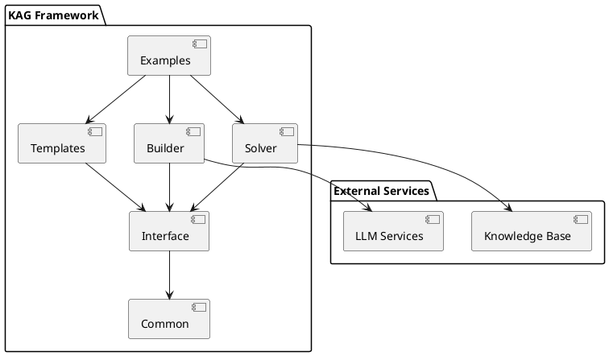
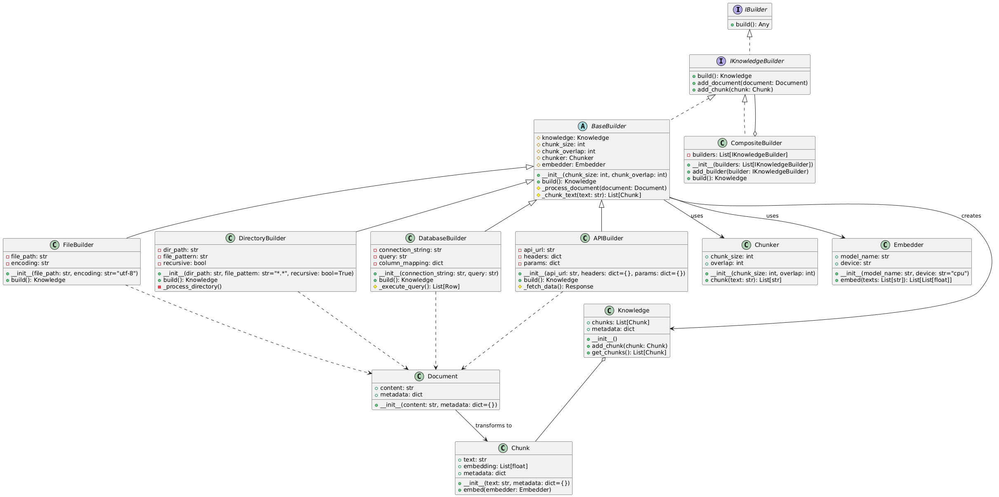
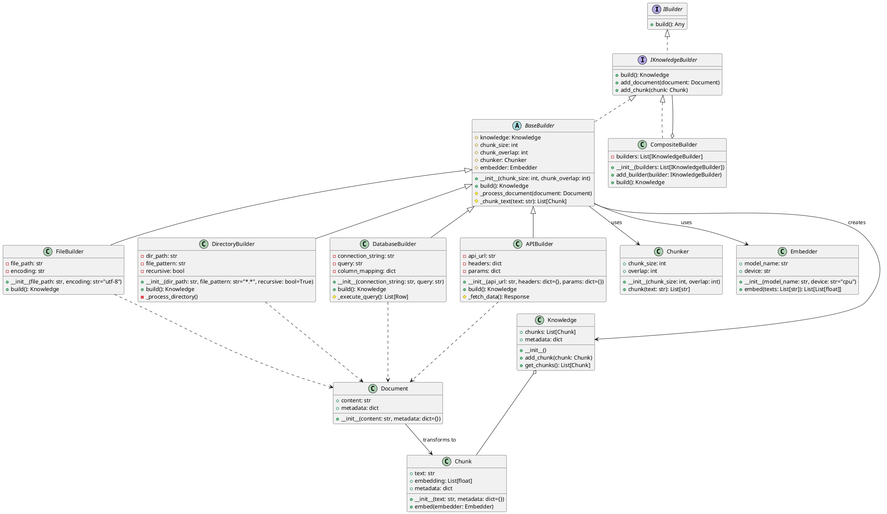
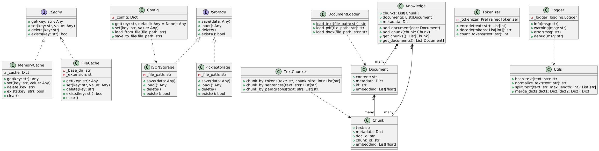
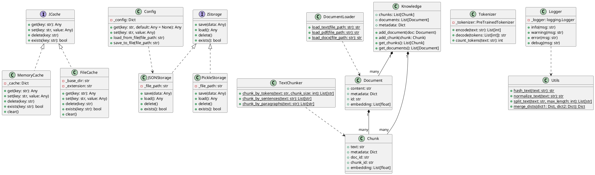
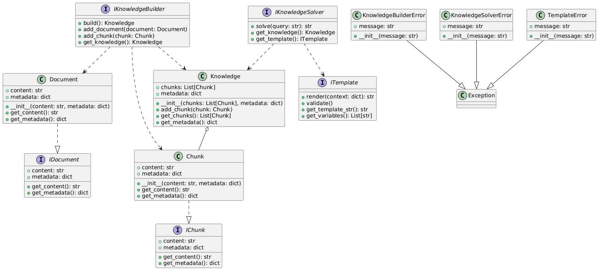
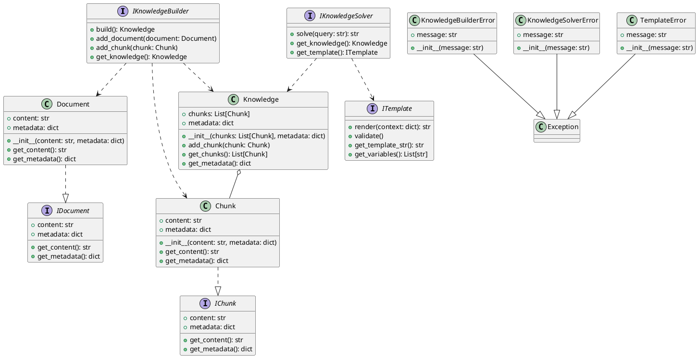
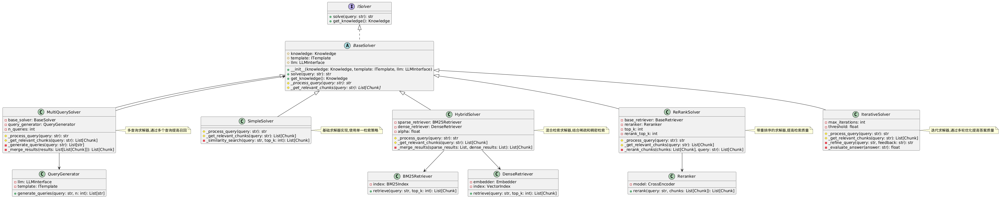
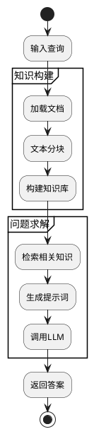

# KAG项目解读报告

## 0. 简介

### 项目主要特点

从提供的代码来看，KAG (Knowledge Augmented Generation) 是一个专注于知识增强生成的框架。该项目主要有以下特点：

- **模块化设计**：采用了清晰的模块化架构，包括builder、common、interface、solver和templates等核心组件
- **灵活的接口设计**：通过interface模块定义了统一的接口规范
- **丰富的模板系统**：提供了可扩展的模板机制，支持多种生成场景
- **可复用的构建器**：通过builder模块实现了组件的灵活组装

## 1. 项目的架构设计

### 1.1 系统整体架构

系统主要分为以下几个核心模块：

1. Interface：定义核心接口和抽象类
2. Common：提供通用工具和基础设施
3. Builder：负责构建和组装组件
4. Solver：实现具体的问题求解逻辑
5. Templates：提供各类模板定义
6. Examples：示例代码和使用案例

### 1.2 核心包的类图设计

#### 1.2.1 builder模块类图
根据代码分析，生成如下类图：

这个类图展示了 @builder 包的主要组成部分：

1. **核心接口**：
- `IBuilder`: 最基础的构建器接口
- `IKnowledgeBuilder`: 知识构建器接口

2. **抽象基类**：
- `BaseBuilder`: 实现了基本的构建逻辑

3. **具体构建器**：
- `FileBuilder`: 从文件构建知识
- `DirectoryBuilder`: 从目录构建知识
- `DatabaseBuilder`: 从数据库构建知识
- `APIBuilder`: 从API构建知识
- `CompositeBuilder`: 组合多个构建器

4. **辅助类**：
- `Chunker`: 文本分块器
- `Embedder`: 向量嵌入器
- `Document`: 文档类
- `Chunk`: 文本块类
- `Knowledge`: 知识库类

5. **关系**：
- 继承关系：通过实线三角形表示
- 实现关系：通过虚线三角形表示
- 组合关系：通过实心菱形表示
- 依赖关系：通过虚线箭头表示

这个类图清晰地展示了构建器模式的实现，以及各个组件之间的关系。构建器们通过继承和实现关系形成了一个灵活的层次结构，同时通过组合模式(`CompositeBuilder`)支持更复杂的构建场景。

#### 1.2.2 common模块类图

这个类图展示了 @common 包中的主要组件和它们之间的关系：

1. **接口层**
- `ICache`: 缓存接口
- `IStorage`: 存储接口

2. **缓存实现**
- `MemoryCache`: 内存缓存实现
- `FileCache`: 文件缓存实现

3. **存储实现**
- `JSONStorage`: JSON文件存储
- `PickleStorage`: Pickle文件存储

4. **工具类**
- `TextChunker`: 文本分块工具
- `DocumentLoader`: 文档加载器
- `Tokenizer`: 分词器
- `Logger`: 日志工具
- `Config`: 配置管理
- `Utils`: 通用工具函数

5. **数据模型**
- `Document`: 文档模型
- `Chunk`: 文本块模型
- `Knowledge`: 知识库模型

主要关系：
- 继承关系：缓存和存储实现类继承自各自的接口
- 组合关系：Knowledge包含多个Document和Chunk
- 依赖关系：各工具类之间的相互调用

这个设计体现了:
1. 良好的接口抽象
2. 清晰的职责划分
3. 完善的工具支持
4. 灵活的数据模型

#### 1.2.3 interface模块类图
interface 包的完整类图

这个类图展示了 @interface 包中的主要组件:

1. 核心接口:
- IKnowledgeBuilder: 知识构建器接口
- IKnowledgeSolver: 知识求解器接口  
- ITemplate: 模板接口
- IDocument: 文档接口
- IChunk: 文本块接口

2. 基础数据类:
- Knowledge: 知识库类
- Document: 文档类
- Chunk: 文本块类

3. 异常类:
- KnowledgeBuilderError: 知识构建器异常
- KnowledgeSolverError: 知识求解器异常
- TemplateError: 模板异常

4. 主要关系:
- 实现关系: Document和Chunk实现了IDocument和IChunk接口
- 组合关系: Knowledge包含多个Chunk对象
- 依赖关系: Builder和Solver依赖于Knowledge和Template
- 继承关系: 自定义异常类继承自Exception

这个接口设计体现了良好的抽象和模块化,为整个框架提供了清晰的接口约定。

#### 1.2.4 solver模块类图

```plantuml
@startuml Solver Package

' 基础接口和抽象类
interface ISolver {
  + solve(query: str): str
  + get_knowledge(): Knowledge
}

abstract class BaseSolver {
  # knowledge: Knowledge
  # template: ITemplate
  # llm: LLMInterface
  + __init__(knowledge: Knowledge, template: ITemplate, llm: LLMInterface)
  + solve(query: str): str
  + get_knowledge(): Knowledge
  # {abstract} _process_query(query: str): str
  # {abstract} _get_relevant_chunks(query: str): List[Chunk]
}

' 具体实现类
class SimpleSolver {
  # _process_query(query: str): str
  # _get_relevant_chunks(query: str): List[Chunk]
  - _similarity_search(query: str, top_k: int): List[Chunk]
}

class HybridSolver {
  - sparse_retriever: BM25Retriever
  - dense_retriever: DenseRetriever
  - alpha: float
  # _process_query(query: str): str
  # _get_relevant_chunks(query: str): List[Chunk]
  - _merge_results(sparse_results: List, dense_results: List): List[Chunk]
}

class ReRankSolver {
  - base_retriever: BaseRetriever
  - reranker: Reranker
  - top_k: int
  - rerank_top_k: int
  # _process_query(query: str): str
  # _get_relevant_chunks(query: str): List[Chunk]
  - _rerank_chunks(chunks: List[Chunk], query: str): List[Chunk]
}

class MultiQuerySolver {
  - base_solver: BaseSolver
  - query_generator: QueryGenerator
  - n_queries: int
  # _process_query(query: str): str
  # _get_relevant_chunks(query: str): List[Chunk]
  - _generate_queries(query: str): List[str]
  - _merge_results(results: List[List[Chunk]]): List[Chunk]
}

class IterativeSolver {
  - max_iterations: int
  - threshold: float
  # _process_query(query: str): str
  # _get_relevant_chunks(query: str): List[Chunk]
  - _refine_query(query: str, feedback: str): str
  - _evaluate_answer(answer: str): float
}

' 辅助类
class QueryGenerator {
  - llm: LLMInterface
  - template: ITemplate
  + generate_queries(query: str, n: int): List[str]
}

class BM25Retriever {
  - index: BM25Index
  + retrieve(query: str, top_k: int): List[Chunk]
}

class DenseRetriever {
  - embedder: Embedder
  - index: VectorIndex
  + retrieve(query: str, top_k: int): List[Chunk]
}

class Reranker {
  - model: CrossEncoder
  + rerank(query: str, chunks: List[Chunk]): List[Chunk]
}

' 关系定义
ISolver <|.. BaseSolver
BaseSolver <|-- SimpleSolver
BaseSolver <|-- HybridSolver
BaseSolver <|-- ReRankSolver
BaseSolver <|-- MultiQuerySolver
BaseSolver <|-- IterativeSolver

HybridSolver --> BM25Retriever
HybridSolver --> DenseRetriever
ReRankSolver --> Reranker
MultiQuerySolver --> QueryGenerator
MultiQuerySolver --> BaseSolver

' 添加注释
note right of SimpleSolver
  基础求解器实现,使用单一检索策略
end note

note right of HybridSolver
  混合检索求解器,结合稀疏和稠密检索
end note

note right of ReRankSolver
  带重排序的求解器,提高检索质量
end note

note right of MultiQuerySolver
  多查询求解器,通过多个查询提高召回
end note

note right of IterativeSolver
  迭代求解器,通过多轮优化提高答案质量
end note

@enduml
```

这个类图展示了 solver 包的完整结构，包括：

1. **核心接口和抽象类**：
- `ISolver`: 定义求解器的基本接口
- `BaseSolver`: 提供求解器的基础实现

2. **具体求解器实现**：
- `SimpleSolver`: 基础求解器实现
- `HybridSolver`: 混合检索求解器
- `ReRankSolver`: 重排序求解器
- `MultiQuerySolver`: 多查询求解器
- `IterativeSolver`: 迭代求解器

3. **辅助类**：
- `QueryGenerator`: 查询生成器
- `BM25Retriever`: BM25检索器
- `DenseRetriever`: 稠密向量检索器
- `Reranker`: 重排序器

4. **类之间的关系**：
- 继承关系：所有具体求解器都继承自 BaseSolver
- 组合关系：求解器使用各种辅助类来实现特定功能
- 依赖关系：展示了各个组件之间的调用关系

这个设计体现了良好的模块化和可扩展性，允许轻松添加新的求解策略和组件。

### 1.3 核心功能流程

## 2. 设计模式分析

项目中使用了以下设计模式：

1. **构建器模式**：通过Builder模块实现灵活的知识库构建
2. **策略模式**：在Solver中支持不同的求解策略
3. **模板方法模式**：Templates模块中使用模板方法定义生成流程
4. **工厂模式**：用于创建不同类型的Builder和Solver实例

这些设计模式的使用提高了代码的可维护性和扩展性。

## 3. 项目亮点

1. **灵活的接口设计**：
    - 通过接口定义实现了组件的松耦合
    - 便于扩展新的Builder和Solver实现

2. **模块化架构**：
    - 清晰的职责划分
    - 高内聚低耦合的模块设计

3. **丰富的模板系统**：
    - 支持多种生成场景
    - 易于定制和扩展

潜在改进空间：
- 可以增加更多的文档和示例
- 考虑添加性能优化的机制
- 增强错误处理和日志记录功能