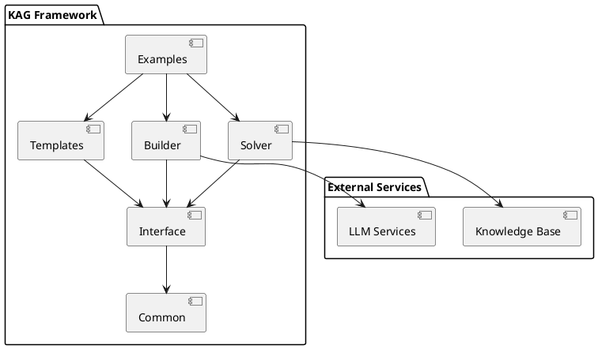
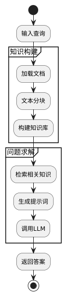
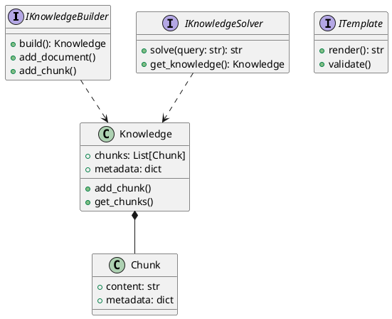
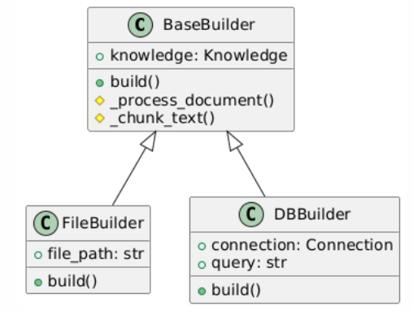
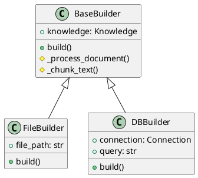
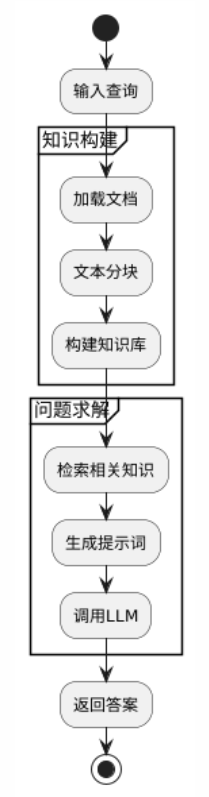
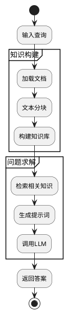

# KAG项目解读报告

## 0. 简介

### 项目主要特点

从提供的代码来看，KAG (Knowledge Augmented Generation) 是一个专注于知识增强生成的框架。该项目主要有以下特点：

- **模块化设计**：采用了清晰的模块化架构，包括builder、common、interface、solver和templates等核心组件
- **灵活的接口设计**：通过interface模块定义了统一的接口规范
- **丰富的模板系统**：提供了可扩展的模板机制，支持多种生成场景
- **可复用的构建器**：通过builder模块实现了组件的灵活组装

## 1. 项目的架构设计

### 1.1 系统整体架构

系统主要分为以下几个核心模块：

1. Interface：定义核心接口和抽象类
2. Common：提供通用工具和基础设施
3. Builder：负责构建和组装组件
4. Solver：实现具体的问题求解逻辑
5. Templates：提供各类模板定义
6. Examples：示例代码和使用案例

### 1.2 核心包的类图设计

#### 1.2.1 Interface模块类图

#### 1.2.2 Builder模块类图

### 1.3 核心功能流程

## 2. 设计模式分析

项目中使用了以下设计模式：

1. **构建器模式**：通过Builder模块实现灵活的知识库构建
2. **策略模式**：在Solver中支持不同的求解策略
3. **模板方法模式**：Templates模块中使用模板方法定义生成流程
4. **工厂模式**：用于创建不同类型的Builder和Solver实例

这些设计模式的使用提高了代码的可维护性和扩展性。

## 3. 项目亮点

1. **灵活的接口设计**：
    - 通过接口定义实现了组件的松耦合
    - 便于扩展新的Builder和Solver实现

2. **模块化架构**：
    - 清晰的职责划分
    - 高内聚低耦合的模块设计

3. **丰富的模板系统**：
    - 支持多种生成场景
    - 易于定制和扩展

潜在改进空间：
- 可以增加更多的文档和示例
- 考虑添加性能优化的机制
- 增强错误处理和日志记录功能