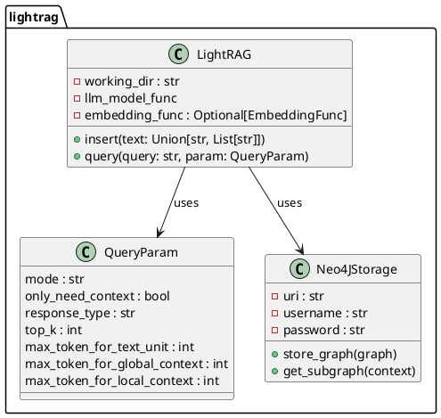
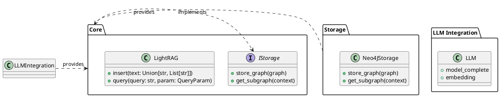
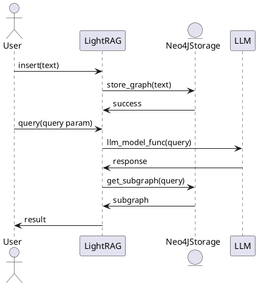

### LightRAG项目解读报告


* 简介：在nano-graphrag基础上构建，主打简单、快速、高质量
* 仓库：
    - https://github.com/HKUDS/LightRAG
    - https://github.com/gusye1234/nano-graphrag
* 关键特点：
  - 支持实体增删
  - 支持Neo4j知识存储
  - 通过 `textract` 实现多文件解析
  - 提供图形化知识表示
* 检索增强流程图：


---

## 1. 项目的顶层架构设计概览
- **核心功能模块**：负责实际的RAG操作，包括插入、查询、批处理插入等。
- **LLM集成模块**：支持多种大型语言模型（包括OpenAI、Ollama、Hugging Face等）。
- **存储模块**：提供数据存储实现，支持多种存储后端（如本地文件系统、Neo4j等）。
- **辅助工具模块**：提供包括图形可视化、API服务、批量处理等功能的各种实用工具。

### 说明核心模块的功能和定位。
- **核心功能模块**：位于`lightrag/`目录下，包括核心的RAG操作实现。
- **LLM集成模块**：主要文件是`lightrag/llm.py`，管理对不同LLM的交互。
- **存储模块**：位于`lightrag/kg/`目录，提供本地和远程（如Neo4j）存储功能。
- **辅助工具模块**：在`examples/`下，提供包括API服务、图形可视化等的示例代码。

## 2. 模块设计与交互细节

> 1. 列出各个模块或子系统，详细说明它们的功能.
> 2. 描述模块之间的交互方式和依赖关系。
> 3. 解释重要的类、函数和接口，以及它们如何协同工作。

#### 主要模块和功能
- **lightrag/** ：核心实现模块；
  - `base.py`：基本类和配置实现。
  - `lightrag.py`：LightRAG的主要类及其方法。
  - `llm.py`：定义和处理各类LLM的接口。
  - `operate.py`：操作相关的函数，例如查询、插入等。
  - `prompt.py`：包含用于生成LLM提示符的模板。
  - `storage.py`：数据存储的抽象和实现。
  - `utils.py`：工具函数，如数据处理等。
- **lightrag/kg/** ：存储相关实现，特别是Neo4j存储。
  - `neo4j_impl.py`：对Neo4j的数据存储实现。

#### 模块交互与类关系
以下是主要模块及其互相调用关系：
- **Core**: `LightRAG` 包含核心商业逻辑。
- **Storage**: 包含`Neo4JStorage`类，用于持久化RAG数据。负责图数据的存储。
- **LLM相关类**: 实现与各种语言模型（如GPT-4、Ollama等）的接口。
- **Query与Insert**：负责数据插入和查询操作。
  
### 解释重要的类、函数和接口

#### `LightRAG` 类
```python
class LightRAG:
    def __init__(self, working_dir: str, llm_model_func, embedding_func: Optional[EmbeddingFunc] = None):
        self.working_dir = working_dir
        self.llm_model_func = llm_model_func
        self.embedding_func = embedding_func
        ...
        
    async def insert(self, text: Union[str, List[str]]):
        ...
        
    async def query(self, query: str, param: QueryParam):
        ...
```
#### `QueryParam` 类
```python
class QueryParam:
    mode: Literal["local", "global", "hybrid", "naive"] = "global"
    only_need_context: bool = False
    response_type: str = "Multiple Paragraphs"
    top_k: int = 60
    max_token_for_text_unit: int = 4000
    max_token_for_global_context: int = 4000
    max_token_for_local_context: int = 4000
```

## 3. 架构和流程图
### 项目架构图
* 详细类图

* 简化类图



### 模块图


### 流程图




## 4. 设计模式和架构决策
### 使用的设计模式
#### 工厂模式
* 用于实例化不同类型的LLM（如OpenAI、Hugging Face）。
#### 策略模式
* 通过不同的`QueryParam`模式来改变查询策略（如“local”、“global”和“hybrid”）。

### 讨论这些选择的原因和优缺点
优点：
- **灵活性**：可以轻松扩展以支持新增的LLM或存储后端。
- **模块化设计**：独立的组件使得系统更容易维护和扩展。
- **高效性**：利用异步编程技术提高了插入和查询的效率。

缺点：
- **复杂度**：模块化设计和多种后端支持增加了系统的复杂度。
- **依赖性**：高度依赖于具体的外部库（如Neo4j、各种LLM API）。

## 5. 总结和建议
### 项目的亮点和创新之处
- 支持多种大型语言模型，包括OpenAI、Hugging Face等。
- 提供灵活的存储后端，支持本地文件和图数据库（Neo4j）。
- 模块化设计，具有良好的扩展性和维护性。

### 潜在的改进空间
- 增加更多的测试用例，确保代码的可靠性和稳定性
- 进一步优化性能，尤其是在处理大规模数据时提高效率
- 增加对更多文件格式的原生支持
- 优化内存管理，特别是在处理大规模向量数据时
- 提供更多的性能监控和调优工具
- 增强API的安全性和访问控制

综上所述，LightRAG是一个功能强大且灵活的检索增强生成系统，尽管存在一些改进空间，但总体来看其设计合理且具有广泛的应用潜力。