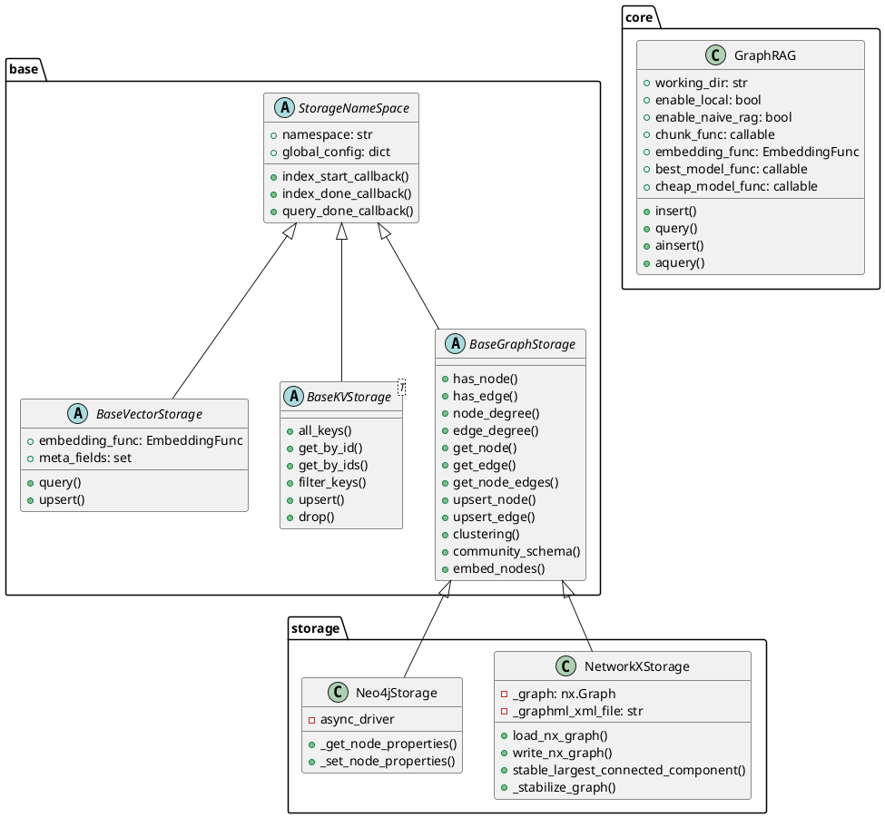
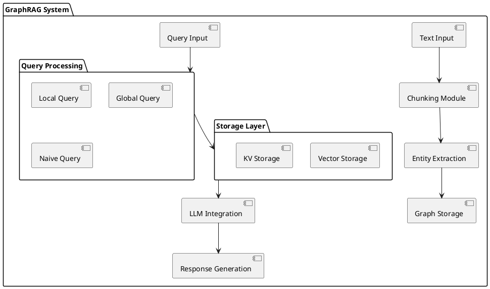

# nano-graphrag 项目解读报告

## 0. 简介

### 项目主要特点

nano-graphrag 是一个轻量级的图形化 RAG (Retrieval-Augmented Generation) 系统实现。该项目的主要目标是:

1. 提供基于图的知识检索和生成能力
2. 支持多种查询模式(本地、全局、朴素)
3. 实现实体关系抽取和社区发现
4. 提供灵活的存储后端支持(NetworkX、Neo4j等)

主要功能包括:
- 文本分块和实体关系抽取
- 图数据存储和检索
- 社区发现和聚类
- 基于 LLM 的查询生成

## 1. 项目的架构设计

### 1.1 核心模块的类图设计




### 1.2 系统整体架构




系统主要分为以下几个层次:

1. 输入处理层:负责文本分块和实体抽取
2. 存储层:提供图存储、向量存储和KV存储能力
3. 查询处理层:支持本地、全局和朴素三种查询模式
4. LLM集成层:与大语言模型交互生成响应

## 2. 设计模式分析

项目使用了以下设计模式:

1. 抽象工厂模式:通过 BaseGraphStorage、BaseVectorStorage 等抽象基类定义存储接口

2. 策略模式:支持不同的查询策略(本地、全局、朴素)和存储后端

3. 装饰器模式:使用装饰器实现异步调用限制和缓存

优点:
- 高度抽象和模块化
- 易于扩展新的存储后端和查询模式
- 异步设计提高性能

缺点:
- 接口较为复杂
- 异步编程增加了代码复杂度

## 3. 项目亮点

1. 灵活的存储抽象:
- 支持多种存储后端
- 统一的异步接口设计
- 参考代码:

```python
# 77:159:thirdparty/nano-graphrag/nano_graphrag/base.py
@dataclass
class BaseVectorStorage(StorageNameSpace):
    embedding_func: EmbeddingFunc
    meta_fields: set = field(default_factory=set)

    async def query(self, query: str, top_k: int) -> list[dict]:
        raise NotImplementedError

    async def upsert(self, data: dict[str, dict]):
        """Use 'content' field from value for embedding, use key as id.
        If embedding_func is None, use 'embedding' field from value
        """
        raise NotImplementedError


@dataclass
class BaseKVStorage(Generic[T], StorageNameSpace):
    async def all_keys(self) -> list[str]:
        raise NotImplementedError

    async def get_by_id(self, id: str) -> Union[T, None]:
        raise NotImplementedError

    async def get_by_ids(
        self, ids: list[str], fields: Union[set[str], None] = None
    ) -> list[Union[T, None]]:
        raise NotImplementedError

    async def filter_keys(self, data: list[str]) -> set[str]:
        """return un-exist keys"""
        raise NotImplementedError

    async def upsert(self, data: dict[str, T]):
        raise NotImplementedError

    async def drop(self):
        raise NotImplementedError
...
@dataclass
class BaseGraphStorage(StorageNameSpace):
    async def has_node(self, node_id: str) -> bool:
        raise NotImplementedError

    async def has_edge(self, source_node_id: str, target_node_id: str) -> bool:
        raise NotImplementedError

    async def node_degree(self, node_id: str) -> int:
        raise NotImplementedError

    async def edge_degree(self, src_id: str, tgt_id: str) -> int:
        raise NotImplementedError

    async def get_node(self, node_id: str) -> Union[dict, None]:
        raise NotImplementedError

    async def get_edge(
        self, source_node_id: str, target_node_id: str
    ) -> Union[dict, None]:
        raise NotImplementedError

    async def get_node_edges(
        self, source_node_id: str
    ) -> Union[list[tuple[str, str]], None]:
        raise NotImplementedError

    async def upsert_node(self, node_id: str, node_data: dict[str, str]):
        raise NotImplementedError

    async def upsert_edge(
        self, source_node_id: str, target_node_id: str, edge_data: dict[str, str]
    ):
        raise NotImplementedError

    async def clustering(self, algorithm: str):
        raise NotImplementedError

    async def community_schema(self) -> dict[str, SingleCommunitySchema]:
        """Return the community representation with report and nodes"""
        raise NotImplementedError

    async def embed_nodes(self, algorithm: str) -> tuple[np.ndarray, list[str]]:
        raise NotImplementedError("Node embedding is not used in nano-graphrag.")
```


2. 高效的实体关系抽取:
- 基于 LLM 的实体和关系抽取
- 支持增量更新
- 参考代码:

```python
# 291:379:thirdparty/nano-graphrag/nano_graphrag/_op.py
async def extract_entities(
    chunks: dict[str, TextChunkSchema],
    knwoledge_graph_inst: BaseGraphStorage,
    entity_vdb: BaseVectorStorage,
    global_config: dict,
) -> Union[BaseGraphStorage, None]:
    use_llm_func: callable = global_config["best_model_func"]
    entity_extract_max_gleaning = global_config["entity_extract_max_gleaning"]

    ordered_chunks = list(chunks.items())

    entity_extract_prompt = PROMPTS["entity_extraction"]
    context_base = dict(
        tuple_delimiter=PROMPTS["DEFAULT_TUPLE_DELIMITER"],
        record_delimiter=PROMPTS["DEFAULT_RECORD_DELIMITER"],
        completion_delimiter=PROMPTS["DEFAULT_COMPLETION_DELIMITER"],
        entity_types=",".join(PROMPTS["DEFAULT_ENTITY_TYPES"]),
    )
    continue_prompt = PROMPTS["entiti_continue_extraction"]
    if_loop_prompt = PROMPTS["entiti_if_loop_extraction"]

    already_processed = 0
    already_entities = 0
    already_relations = 0
    async def _process_single_content(chunk_key_dp: tuple[str, TextChunkSchema]):
        nonlocal already_processed, already_entities, already_relations
        chunk_key = chunk_key_dp[0]
        chunk_dp = chunk_key_dp[1]
        content = chunk_dp["content"]
        hint_prompt = entity_extract_prompt.format(**context_base, input_text=content)
        final_result = await use_llm_func(hint_prompt)

        history = pack_user_ass_to_openai_messages(hint_prompt, final_result)
        for now_glean_index in range(entity_extract_max_gleaning):
            glean_result = await use_llm_func(continue_prompt, history_messages=history)

            history += pack_user_ass_to_openai_messages(continue_prompt, glean_result)
            final_result += glean_result
            if now_glean_index == entity_extract_max_gleaning - 1:
                break

            if_loop_result: str = await use_llm_func(
                if_loop_prompt, history_messages=history
            )
            if_loop_result = if_loop_result.strip().strip('"').strip("'").lower()
            if if_loop_result != "yes":
                break

        records = split_string_by_multi_markers(
            final_result,
            [context_base["record_delimiter"], context_base["completion_delimiter"]],
        )
        maybe_nodes = defaultdict(list)
        maybe_edges = defaultdict(list)
        for record in records:
            record = re.search(r"\((.*)\)", record)
            if record is None:
                continue
            record = record.group(1)
            record_attributes = split_string_by_multi_markers(
                record, [context_base["tuple_delimiter"]]
            )
            if_entities = await _handle_single_entity_extraction(
                record_attributes, chunk_key
            )
            if if_entities is not None:
                maybe_nodes[if_entities["entity_name"]].append(if_entities)
                continue

            if_relation = await _handle_single_relationship_extraction(
                record_attributes, chunk_key
            )
            if if_relation is not None:
                maybe_edges[(if_relation["src_id"], if_relation["tgt_id"])].append(
                    if_relation
                )
        already_processed += 1
        already_entities += len(maybe_nodes)
        already_relations += len(maybe_edges)
        now_ticks = PROMPTS["process_tickers"][
            already_processed % len(PROMPTS["process_tickers"])
        ]
        print(
            f"{now_ticks} Processed {already_processed}({already_processed*100//len(ordered_chunks)}%) chunks,  {already_entities} entities(duplicated), {already_relations} relations(duplicated)\r",
            end="",
            flush=True,
        )
```


3. 多样化的查询模式:
- 本地、全局、朴素三种查询策略
- 社区发现和聚类支持
- 参考代码:

```python
    # 209:249:thirdparty/nano-graphrag/nano_graphrag/graphrag.py
    def query(self, query: str, param: QueryParam = QueryParam()):
        loop = always_get_an_event_loop()
            return loop.run_until_complete(self.aquery(query, param))

    async def aquery(self, query: str, param: QueryParam = QueryParam()):
        if param.mode == "local" and not self.enable_local:
            raise ValueError("enable_local is False, cannot query in local mode")
        if param.mode == "naive" and not self.enable_naive_rag:
            raise ValueError("enable_naive_rag is False, cannot query in naive mode")
        if param.mode == "local":
            response = await local_query(
                query,
                self.chunk_entity_relation_graph,
                self.entities_vdb,
                self.community_reports,
                self.text_chunks,
                param,
                asdict(self),
            )
        elif param.mode == "global":
            response = await global_query(
                query,
                self.chunk_entity_relation_graph,
                self.entities_vdb,
                self.community_reports,
                self.text_chunks,
                param,
                asdict(self),
            )
        elif param.mode == "naive":
            response = await naive_query(
                query,
                self.chunks_vdb,
                self.text_chunks,
                param,
                asdict(self),
            )
        else:
            raise ValueError(f"Unknown mode {param.mode}")
        await self._query_done()
        return response
```


改进建议:
1. 增加并行处理能力
2. 添加更多存储后端支持
3. 优化内存使用
4. 增强错误处理机制